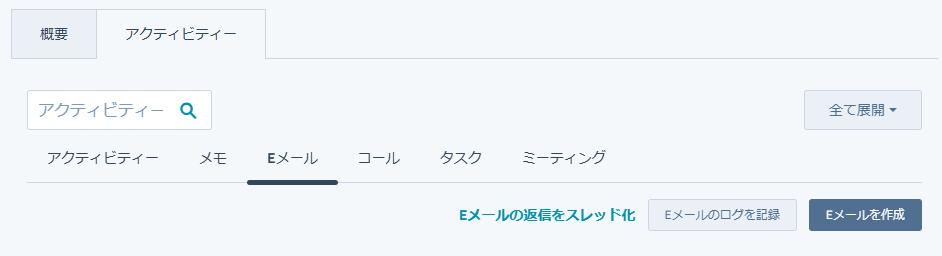

<!-- _paginate : skip -->
<!-- _class : cover -->

# IS 対応マニュアル
## 一次対応の方法

---
<!-- _header : IS 対応マニュアル 一次対応 -->
<!-- _class: overview sm -->

## 目次

- [一次対応について](#purpose)
- [LINKEY商材の新規導入検討の場合](#newcomer)
- [LINKEY商材の追加導入検討の場合](#repeater)
- [LINKEY以外の商材導入検討の場合](#other-item)
- [ユーザーからのサポートの場合](#support)
- [ユーザーからの契約関連の問い合わせの場合](#contract)
- [代理店・パートナー希望の場合](#partners)
- [セールスの場合](#sales)

---
<!-- _header : IS 対応マニュアル 一次対応 > 一次対応について-->
<!-- _class: sm -->

## 一次対応について

### 一次対応とは

対応が必要な問い合わせに対し、内容を識別し、HubSpot レコードを作成し、場合によってはメール返信を行い、対応完了したことを社内報告すること。
新規顧客か既存顧客か、商材、新規導入案件かサポート案件か、問い合わせの内容によって、どこまで対応するかが変わってくる。

### 一次対応の目的

- 重複対応の防止
- 迅速な初動対応
- 対応もれの防止
- データ不備の防止

---
<!-- _header : IS 対応マニュアル 一次対応 > 一次対応について-->

下記の製品サイトと外部メディアより、フォーム問い合わせがくる。
製品サイトには電話番号も掲載されているため、電話問い合わせもくる。
本マニュアルでは、フォーム問い合わせの一次対応方法について記載する。

### 製品サイト

マーケ部で運営しているLINKEY Plusの製品サイト

- [民泊LP](https://www.linkey-lock.com/minpaku/)
- [新Web](https://www.linkey-lock.com/)
- [コーポレートHP](https://www.ume-hikari.net/)
- ペライチ／Wixのサイトもあったが現在は閉じている

---
<!-- _header : IS 対応マニュアル 一次対応 > 一次対応について-->

### 外部の掲載メディア

外部が運営しているサイトでLINKEY Plusの製品ページを作成し、掲載している

- アスピック
- ミツモア
- イプロス
- ビズクロ

### ISでの使用ツール

- Hubspot：CRM（顧客管理）ツール
- Trello：タスク管理ツール
- Dialpad：クラウド電話ツール

---
<!-- _header : IS 対応マニュアル 一次対応 > LINKEY商材の新規導入検討の場合-->

## LINKEY商材の新規導入検討の場合

#### 対応の流れ

1. メールアドレスでHubspot内に重複データがないか確認
1. ない場合、レコード新規作成
1. プロパティ更新
1. メール送信
1. タスク処理
1. Trelloカード更新
1. Gmailにて対応完了報告

---
<!-- _header : IS 対応マニュアル 一次対応 > LINKEY商材の新規導入検討の場合-->
<!-- _class: sm image-h200 -->

### 1.メールアドレスでHubspot内に重複データがないか確認

#### 手順

- 問い合わせ者のメールアドレスをコピー
- Hubspotの一番左のアイコンが縦に並んでいる箇所から「コンタクト」を選択
- 「全てのコンタクト」の検索窓に、コピーしたメールアドレスをペースト
- 検索条件に一致するコンタクトがないことを確認
- \> ある場合はそのコンタクトを選択

---
<!-- _header : IS 対応マニュアル 一次対応 > LINKEY商材の新規導入検討の場合-->
<!-- _class: sm image-h300 -->

### 2.レコード新規作成

#### 手順

- 右上の「コンタクトを作成」ボタンクリック
- “コンタクトを作成”ページが出てくるので、”Eメール”に問い合わせ者のアドレスをコピぺ
- 下側にある「作成」ボタンクリック
- コンタクトレコードが新規作成されたことを確認

---
<!-- _header : IS 対応マニュアル 一次対応 > LINKEY商材の新規導入検討の場合-->

### 2.レコード新規作成

#### コーポレートHP問い合わせの場合のみ

- Gmailの問い合わせフォームの内容を全てコピー
- Hubspotの「メモ」にペースト

民泊LPや新Web問い合わせは、Hubspotと連携しているフォームより送信されるため、
問い合わせ者のフォーム入力情報は自動でHubspotのアクティビティーに残る仕様になっている。

---
<!-- _header : IS 対応マニュアル 一次対応 > LINKEY商材の新規導入検討の場合-->

### 3.プロパティ更新 - コンタクトレコード

コンタクトレコードの下記セクション内のプロパティを更新する。

- このコンタクトの概要
- 問い合わせ基本情報
- 問い合わせ内容詳細
- ヒアリング事項

各セクション・プロパティの入力ルールは[こちら](https://docs.google.com/document/d/1r7fNILlrSG4xram_D-H_yWUVuaJSOS5fATU5Q5cnhMk/edit?usp=sharing)
定期的な数値計測・分析に活用しているため、分かる情報は全てもれなく入力すること。

---
<!-- _header : IS 対応マニュアル 一次対応 > LINKEY商材の新規導入検討の場合-->

### 3.プロパティ更新 - 会社レコード

フォームに会社名が入力されている場合、会社レコードを作成。
入力がない場合は、作成不要。
先方とのやりとりを通じ、メール署名欄等で会社名が分かり次第、作成する。

- コンタクトレコードページの右上「会社（0件）」の右側「＋追加」押下。
- 「既存のものを追加」の「会社を検索」に会社名入力し、既存の会社レコードがないことを確認。
- 左側の「新規作成」の「会社名」に入力＞「作成」
- 「この会社の概要」セクション・プロパティ更新

各セクション・プロパティの入力ルールは[こちら](https://docs.google.com/document/d/1r7fNILlrSG4xram_D-H_yWUVuaJSOS5fATU5Q5cnhMk/edit?usp=sharing)

---
<!-- _header : IS 対応マニュアル 一次対応 > LINKEY商材の新規導入検討の場合-->
<!-- _class: sm image-w500 -->

### 4.メール送信

#### 手順

- プロパティ更新時、「問い合わせ内容分類（WF）」「問い合わせパターン（WF）」の値によって、自動でタスク作成されていることを確認。 
- 作成されたタスクのタイトルを確認。
  例：「一次対応_資料確認依頼 メール送信」
- 該当のメールテンプレを選択。
- 「Eメール」\> 右側の「Eメールを作成」\> Eメール作成画面の左上にある「テンプレート」\> 「LINKEY IS 一次対応（資料あり）」or「LINKEY IS 一次対応（資料なし）」で該当のフォルダ選択\> 該当のテンプレート選択。
- メール内容に不備がないことを確認のうえ「送信」

---
<!-- _header : IS 対応マニュアル 一次対応 > LINKEY商材の新規導入検討の場合-->

### 4.メール送信 - テンプレート選択

IS対応時に使うテンプレートには種類が複数ある。

|フォルダ名|説明|
|-|-|
|LINKEY IS 一次対応 (資料あり)|主に<a href="https://www.ume-hikari.net/contact/">コーポHP</a>や電話問い合わせ時に利用。  問い合わせフォーム送信後、Hubspot上で設定している自動返信メール（件名：【資料・価格表】スマート電子錠 LINKEY Plus (リンキー・プラス) お問い合わせありがとうございます。  ）が送信されて<strong>いない</strong>場合、資料ありのフォルダ内から選択する。 |
|LINKEY IS 一次対応 (資料なし)|主に<a href="https://www.linkey-lock.com/minpaku/">民泊LP</a>や<a href="https://www.linkey-lock.com/">新Web</a>問い合わせ時に利用。 問い合わせフォーム送信後、Hubspot上で設定している自動返信メールが送信されて<strong>いる</strong>場合は資料なしのフォルダ内から、選択する。|
|LINKEY IS 追客・その他|その他追客対応時や価格改訂やキャンペーン案内等幅広い用途で使う際に選択する。|

---
<!-- _header : IS 対応マニュアル 一次対応 > LINKEY商材の新規導入検討の場合-->

### 5. タスク整理

自動で作成されるタスクには、説明欄にチェックリストを設けている。

例 :
[ ] レコード作成
[ ] 資料メール送信
[ ] Trello カード完了
[ ] 対応完了報告

タスクの進捗に応じて、以下の形式でカッコ内のスペースを半角英字で置き換える。

[w] 進行中。Working の w。
[x] 完了
[-] 中止

全て完了したらタスクにチェックをつけて終了。
次のタスクが作成されていることを確認。

---
<!-- _header : IS 対応マニュアル > 一次対応-->

### 6.Trelloカード更新

問い合わせ受け付け時に作成したカードの期日にチェックを入れて、「IS 完了」リストに移動させる。

Trelloカードの入力方法・説明は[こちら](https://docs.google.com/document/d/1DRouAwQC5op5pLMc9HhXiXacVwaKiEQ9bJUKe60iL4A/edit?usp=sharing)

---
<!-- _header : IS 対応マニュアル 一次対応 > LINKEY商材の新規導入検討の場合-->

### 7.Gmailにて対応完了報告

#### 手順

1. 問い合わせ通知メールを転送
1. 宛先に問い合わせ通知メールの宛先と同じ部署を追加
    - To:セールス各位、マーケティング各位 が多い。
    - To:info(全社宛)の場合もある。
1. 件名はいじらず、対応完了報告した旨と作成したHubspotレコードリンクを本文に記載のうえ送信。

---
<!-- _header : IS 対応マニュアル > 一次対応 > LINKEY商材の追加導入検討の場合 -->

## LINKEY商材の追加導入検討の場合

#### 対応の流れ

1. メールアドレスでHubspot内のデータ確認
2. プロパティ更新
3. タスク作成し、担当者へ取次対応
4. Trelloカード更新
5. Gmailにて対応完了報告

---
<!-- _header : IS 対応マニュアル > 一次対応 > LINKEY商材の追加導入検討の場合 -->

### 1.メールアドレスでHubspot内のデータ確認

#### 手順

- 問い合わせ者のメールアドレスをコピー
- Hubspotの一番左のアイコンが縦に並んでいる箇所から「コンタクト」を選択
- 「全てのコンタクト」の検索窓に、コピーしたメールアドレスをペースト
- 検索条件に一致するコンタクトを確認
- コンタクト担当者・問い合わせ担当者・過去のやりとりをタイムラインアクティビティから確認

---
<!-- _header : IS 対応マニュアル > 一次対応 > LINKEY商材の追加導入検討の場合 -->

### 2.プロパティ更新 - コンタクトレコード

コンタクトレコードの下記セクション内のプロパティで更新できる箇所があれば随時更新する。
既に入力されているプロパティでも、最新の情報に書き換えて問題ない。

- このコンタクトの概要
- 問い合わせ基本情報
- 問い合わせ内容詳細
- ヒアリング事項

各セクション・プロパティの入力ルールは[こちら](https://docs.google.com/document/d/1r7fNILlrSG4xram_D-H_yWUVuaJSOS5fATU5Q5cnhMk/edit?usp=sharing)
分かる情報は全てもれなく入力。Hubspotのデータ収集・分析に活用しているため。

---
<!-- _header : IS 対応マニュアル > 一次対応 > LINKEY商材の追加導入検討の場合 -->

### 2.プロパティ更新 - 会社レコード

会社レコードがある場合、下記セクション内のプロパティで更新できる箇所があれば随時更新する。
既に入力されているプロパティでも、最新の情報に書き換えて問題ない。

- この会社の概要

また会社名が判明しているが、会社レコードが作成されていない場合は、作成する。
作成方法は前セクションの「3.プロパティ更新 - 会社レコード」ページ参照。
各セクション・プロパティの入力ルールは前ページ内のリンク参照。

---
<!-- _header : IS 対応マニュアル > 一次対応 > LINKEY商材の追加導入検討の場合 -->

### 3.タスク作成し、担当者へ取次対応

基本的に既存のコンタクト担当者へ取次をする。
タスク作成方法は下記の通り。

|項目|説明|
|-|-|
|タイトル|タスクのタイトル。やることや予定がわかりやすいような短文を入れる。タイトルの文章の主語が、タスクの担当者になるようにする。 例：メール送信／一次対応／見積作成依頼 to 営業事務|
|期日|このタスクをいつまでに行うか、という日付と時間。 ISでは、その日時までにやる、ではなく、その日中に行う、という意味で使う。 営業部など他の部署にタスクを依頼する際に使う場合には、〜までにやってくださいの意味で使うので注意が必要。|
|割り当て先|このタスクの割り当て先のメンバー。自分以外のメンバーを指定することができる。 その場合は、その人にそのタスクを依頼することになる。|

次ページに続く

---
<!-- _header : IS 対応マニュアル > 一次対応 > LINKEY商材の追加導入検討の場合 -->

|項目|説明|
|-|-|
|優先度|このタスクの重要性や緊急性に応じて割り振る 3つの 優先度 (低、中、高)。 ISでは、基本的に一次対応と追客は "低"、社内の他者に依頼するタスクや顧客からの返信対応は "中"、顧客から催促されているなどの緊急時は "高" にする。|
|説明|自由記述の説明欄。ISでは、この部分に細かなチェックリストを記入している。|
|コメント|割り当て先の人をアットメンションでコメントすることで通知を飛ばせる。 その他HubSpotメンバーとメッセージを交換するのにも使用する。 説明欄でもアットメンションでメッセージを送ることができるが、送信者と送信時間が記載されないため、必ずコメントにてメンションする。|

---
<!-- _header : IS 対応マニュアル > 一次対応 > LINKEY商材の追加導入検討の場合 -->

### 4.Trelloカード更新

[こちら](#trello-card-update)と同様。

### 5.Gmailにて対応完了報告

[こちら](#gmail-complete)と同様。

---
<!-- _header : IS 対応マニュアル > 一次対応 > LINKEY以外の商材導入検討の場合 -->

## LINKEY以外の商材導入検討の場合

#### 対応の流れ

1. メールアドレスでHubspot内に重複データがないか確認
1. ない場合、レコード新規作成
1. プロパティ更新
1. Trelloカード更新
1. Gmailにて対応依頼

---
<!-- _header : IS 対応マニュアル > 一次対応 > LINKEY以外の商材導入検討の場合 -->

### 1.メールアドレスでHubspot内に重複データがないか確認

- 問い合わせ者のメールアドレスをコピー
- Hubspotの一番左のアイコンが縦に並んでいる箇所から「コンタクト」を選択
- 「全てのコンタクト」の検索窓に、コピーしたメールアドレスをペースト
- 検索条件に一致するコンタクトがないことを確認
  ある場合はそのコンタクトを選択

---
<!-- _header : IS 対応マニュアル > 一次対応 > LINKEY以外の商材導入検討の場合 -->
<!-- _class: sm -->

### 2.レコード新規作成

既存のHubspotレコードがない場合のみ

- 右上の「コンタクトを作成」ボタンクリック
- “コンタクトを作成”ページが出てくるので、”Eメール”に問い合わせ者のアドレスをコピぺ
- 下側にある「作成」ボタンクリック
- コンタクトレコードが新規作成されたことを確認

### 3.プロパティ更新 - コンタクトレコード

コンタクトレコードの下記2セクションのプロパティを更新する。
その他セクションは、現状LINKEY関連商材でしか活用していないため入力不要。

- このコンタクトの概要
- 問い合わせ基本情報

各セクション・プロパティの入力ルールは[こちら](https://docs.google.com/document/d/1r7fNILlrSG4xram_D-H_yWUVuaJSOS5fATU5Q5cnhMk/edit?usp=sharing)

---
<!-- _header : IS 対応マニュアル > 一次対応 > LINKEY以外の商材導入検討の場合 -->

### 3.プロパティ更新 - 会社レコード

フォームに会社名が入力されている場合、会社レコードを作成。
作成方法は、LINKEY商材の新規導入検討の場合セクションの「3.プロパティ更新 - 会社レコード」ページ参照。
会社名の入力がない場合は、作成不要。

各セクション・プロパティの入力ルールは[こちら](https://docs.google.com/document/d/1r7fNILlrSG4xram_D-H_yWUVuaJSOS5fATU5Q5cnhMk/edit?usp=sharing)

---
<!-- _header : IS 対応マニュアル > 一次対応 > LINKEY以外の商材導入検討の場合 -->

### 4.Trelloカード更新

[こちら](#trello-card-update)と同様。

---
<!-- _header : IS 対応マニュアル > 一次対応 > LINKEY以外の商材導入検討の場合 -->
<!-- _class: sm -->

### 5.Gmailにて対応依頼

商材の営業担当者宛に、Gmailにて対応依頼メールを送信する。

#### 手順

1. 問い合わせ通知メールを転送。
1. 「件名を編集」で商材名と新規導入問い合わせの旨を記載。
    - 例：【対応依頼】CC新規導入検討問い合わせ
1. 宛先(To)に営業担当者の名前 and セールス各位。Ccに問い合わせ通知メールの宛先と同じ部署を追加。
    - To:○○（担当営業）さん、セールス各位、
    - Cc:マーケ各位 or 各位(info)
  1. 対応依頼の旨と作成したHubspotレコードリンクを本文に記載のうえ送信。

---
<!-- _header : IS 対応マニュアル > 一次対応 > LINKEY以外の商材導入検討の場合 -->

## ユーザーからのサポート・ 契約関連の問い合わせの場合

どちらの場合もレコード作成は不要。担当部署へ対応依頼のメール送信をするのみ。
もし、既に担当者にて対応済みの報告メールがあった場合はスルーでOK

---
<!-- _header : IS 対応マニュアル > 一次対応 > LINKEY以外の商材導入検討の場合 -->

#### 問い合わせ対応の流れ

1. 問い合わせ通知メールを転送。
2. 「件名を編集」でサポート or 契約関連問い合わせの旨を記載。
    - 例：【対応依頼】サポート or 契約関連問い合わせ
3. 宛先(To)に下記の該当部署選択。Ccに問い合わせ通知メールの宛先と同じ部署を追加。
    - サポート：テクサポ各位（fine.cs@）
    - 契約関連：総務各位（general@）
  1. 対応依頼の旨を本文に記載のうえ送信。

---
<!-- _header : IS 対応マニュアル > 一次対応 > LINKEY以外の商材導入検討の場合 -->

## 代理店・パートナー希望、セールスの場合

代理店・パートナー希望目的の問い合わせの場合、その対応判断が難しいケースが多い。

協業希望の皮を被ったセールス問い合わせは多いので、最初は一緒に対応していく。
マーケティング領域 (Web 制作や広告運用) と人材関連、M&A や資金調達の案件の場合はセールスなので無視する。

SH 事業 (LINKEY、Finelink、smaE、Cocon) や CC 事業 (CC、JLS24) の可能性が広がるような案件は非常に価値があるので、レコード作成を行い、担当部署へ取次を行う。
その際の流れは、「LINKEY以外の商材導入検討の場合」セクションと同様。

---
<!-- _class: cover -->

# おしまい

