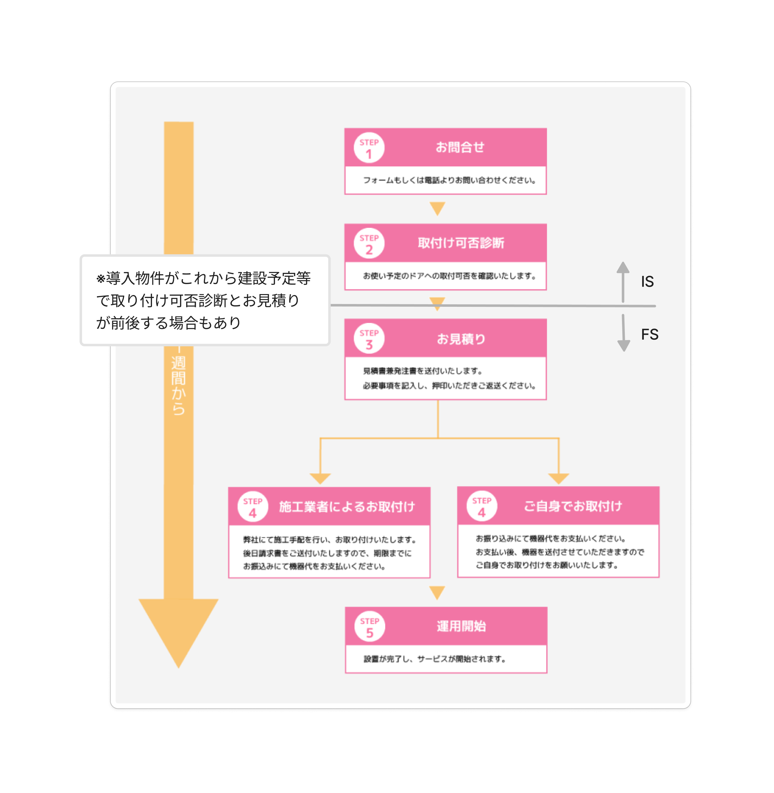
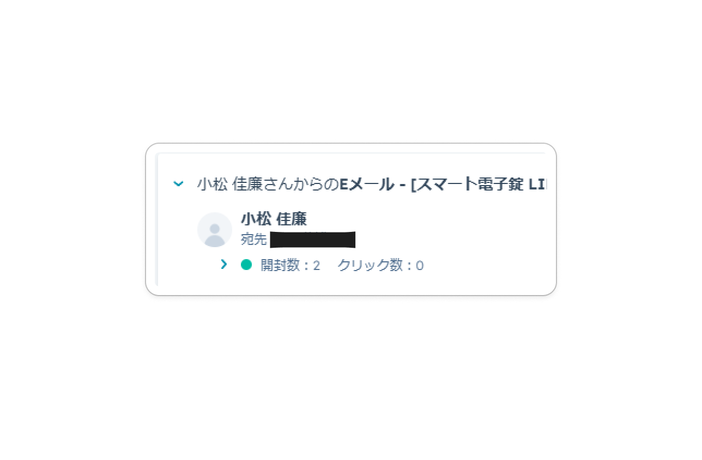
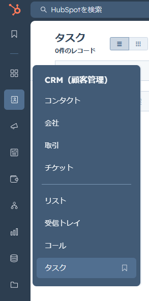

<!-- _paginate : skip -->
<!-- _class : cover -->

# IS 対応マニュアル
## 追客対応の方法

---
<!-- _header : IS 対応マニュアル 追客対応の方法 -->
<!-- _class: overview sm -->

## 目次

- [問い合わせ～導入の流れ](#flow)
- [追客対応とは](#intro)
- [反響なしの場合](#no-response)
- [反響ありの場合](#response)
- [日々のタスク処理について](#daily)
- [追客時の電話フォローについて](#call_follow)

---
<!-- _header : IS 対応マニュアル 追客対応の方法 > 問い合わせ ~ 導入の流れ-->
<!-- _class: image-h600 sm-->

## 問い合わせ～導入の流れ

問い合わせ～導入までの一般的な流れは画像の通り。
基本的に見積作成を境に、管轄が変わる。

見積作成前まではIS（マーケ部）で、見積作成以降はFS（営業部）となる。ISとFS兼任の場合は、見積作成以降はFS（営業部）としての対応をすることになる。

ISでは可能な限り、購入確度の高いリードを見積作成フェーズに移行させることを意識する。
なぜなら見積作成にはより多くの人件費を費やすため。（営業事務や施工業者、工事班、営業担当者等）

---
<!-- _header : IS 対応マニュアル 追客対応の方法 > 問い合わせ ~ 導入の流れ-->

IS追客対応では、主に下記要件がクリアしたリードを見積作成フェーズへ移行させることが理想。

- 価格：予算内か、予算オーバーでも機器の性能・機能を理解し、導入検討に前向きか
- プラン・機能：リードが望む機能・叶えたいことがLINKEY Plusで実現可能か
- 施工条件：LINKEY Plusに適合しているドア・錠前か、不適合の場合は穴あけ工事での施工を了承しているか

そのため追客対応時に可能な限り、リードの検討状況を詳細にヒアリングする。

---
<!-- _header : IS 対応マニュアル 追客対応の方法 > 追客対応とは -->

## 追客対応とは

日々のメールや電話でのやりとりで、IS対応のリードへ適切なタイミングで、必要なヒアリング・情報提供を行うことを指す。
購入確度の高いリードをFSへ引継ぎ、顧客にすることが目標。

---
<!-- _header : IS 対応マニュアル 追客対応の方法 > 追客対応とは -->

## 追客対応とは

追客対応＝タスク処理という認識で問題ない。
Hubspotの自動化WFのタスクや個別タスクで、日々タスク設定・処理を行う。

そのため全てのリードには、常に何かしらのタスクが設定されている状態。
本マニュアルでは、適切な追客対応の方法について説明する。

---
<!-- _header : IS 対応マニュアル 追客対応の方法 > 追客対応とは -->

一次対応時に送信した資料の開封状況やメール返信の有無等、リードの反応によって、追客対応の方法が変わる。

リードの反響あり／なしの定義を明記する。

- 反響あり：メール開封あり and/or 資料クリックあり and/or メール返信・電話あり
- 反響なし：メール開封なし

---
<!-- _header : IS 対応マニュアル 追客対応の方法 > 追客対応とは -->
<!-- _class: image-w500 -->

Hubspotのアクティビティを確認する。

- 開封数＝メール開封数
- クリック数＝資料クリック数

> ※画像の場合だと、メール開封は2回しているが、 資料のクリックはされていない状態。

---
<!-- _header : IS 対応マニュアル 追客対応の方法 > 反響なしの場合 -->

## 反響なしの場合

基本的にHubspotにて設定している自動作成タスクを処理していく流れとなる。
途中でリードよりメール返信や電話等があった場合は、随時返信対応が必要となる。
本セクションでは、全く反応なしのリードの対応方法を記載する。

---
<!-- _header : IS 対応マニュアル 追客対応の方法 > 反響なしの場合 -->

### 対応の流れ

1. IS追客管理セクションの内容を確認する
1. 一次メール開封確認を行う
1. メール再送タスクを処理する
1. （数日後）メール開封再確認を行う
1. （さらに数日後）追客完了タスクを処理する

---
<!-- _header : IS 対応マニュアル 追客対応の方法 > 反響なしの場合 > 対応の流れ-->

### 1.IS追客管理セクションの内容を確認する

施工条件案内ステータス（WF）とメール再送ステータス（WF）の値が間違っていないか確認。
必要があれば値を変更する。

詳細は[こちら](https://docs.google.com/document/d/1r7fNILlrSG4xram_D-H_yWUVuaJSOS5fATU5Q5cnhMk/edit?tab=t.0#heading=h.89fcylo96nf8)に記載。

---
<!-- _header : IS 対応マニュアル 追客対応の方法 > 反響なしの場合 > 対応の流れ-->

### 2.一次メール開封確認を行う 

#### 手順

1. 一次メール開封確認タスクの説明欄 ”[ ] メール開封確認プロパティを更新”のチェックリストを[w]に更新。
1. メール開封確認（WF）の値を「反響なし（開封なし）」に変更。
1. 一次メール開封確認タスクの説明欄 ”[ ] メール開封確認プロパティを更新”のチェックリストを[x]に更新。
1. 一次メール開封確認タスクにチェックを付けて完了にする。

---
<!-- _header : IS 対応マニュアル 追客対応の方法 > 反響なしの場合 > 対応の流れ-->

### 3.メール再送タスクを処理する

#### 手順

1. メール送信タスクの説明欄 ”[ ] メール再送”のチェックリストを[w]に更新。
2. メールを作成＞テンプレート選択＞「LINKEY IS 追客・その他」フォルダ選択＞「追客 - 検討状況ヒアリング」テンプレ選択。
3. メール内容に問題がないことを確認し、送信。
4. メール送信タスクの説明欄 ”[ ] メール再送”のチェックリストを[x]に更新。
5. メール送信タスクの説明欄 ”[ ] メール再送ステータス = 再送したを選択”のチェックリストを[w]に更新。

次ページに続く

---
<!-- _header : IS 対応マニュアル 追客対応の方法 > 反響なしの場合 > 対応の流れ-->

6. メール再送ステータス（WF）プロパティを「メールを再送した」に変更
7. メール送信タスクの説明欄 ”[ ] メール再送ステータス = 再送したを選択”のチェックリストを[x]に更新。
8. メール再送タスクの説明欄 ”[ ] メール開封確認 = 空白に戻す”のチェックリストを[w]に更新。
9. メール開封確認（WF）プロパティを「空白」に変更
10. メール再送タスクの説明欄 ”[ ] メール開封確認 = 空白に戻す”のチェックリストを[x]に更新。
11. メール再送タスクにチェックを付けて完了にする。

---
<!-- _header : IS 対応マニュアル 追客対応の方法 > 反響なしの場合 > 対応の流れ-->

### 4.（数日後）メール開封再確認を行う

#### 手順

1. メール開封再確認タスクの説明欄 ”[ ] メール開封確認プロパティを更新 (一度空白にして保存してから)”のチェックリストを[w]に更新。
1. メール開封確認（WF）プロパティを「反響なし（開封なし）」に変更。
1. メール開封再確認タスクの説明欄 ”[ ] メール開封確認プロパティを更新 (一度空白にして保存してから)”のチェックリストを[x]に更新。
1. メール開封再確認タスクにチェックを付けて完了にする。

---
<!-- _header : IS 対応マニュアル 追客対応の方法 > 反響なしの場合 > 対応の流れ-->

### 5.（さらに数日後）追客完了タスクを処理する

#### 手順

1. 追客完了タスクの説明欄 ”[ ] ライフサイクルステージ = 登録読者に変更”のチェックリストを[w]に更新。
2. ライフサイクルステージプロパティを「登録読者」に変更。
3. 追客完了タスクの説明欄 ”[ ] ライフサイクルステージ = 登録読者に変更”のチェックリストを[x]に更新。
4. 追客完了タスクの説明欄 ”[ ] IS 対応完了の理由 = 反響なしを選択” ”[ ] IS 対応完了日 = 当日の日付を入力”のチェックリストを[w]に更新。

次ページに続く

---
<!-- _header : IS 対応マニュアル 追客対応の方法 > 反響なしの場合 > 対応の流れ-->

5. 追客完了日プロパティを当日の値に更新。
6. IS対応完了の理由プロパティを「反応なし」に更新。
7. 追客完了タスクの説明欄 ”[ ] IS 対応完了の理由 = 反響なしを選択” ”[ ] IS 対応完了日 = 当日の日付を入力”のチェックリストを[x]に更新。
8. 追客完了タスクにチェックを付けて完了にする。

---
<!-- _header : IS 対応マニュアル 追客対応の方法 > 反響ありの場合 -->
<!-- _class: sm -->

## 反響ありの場合

基本的にはリードの反応状況（資料クリック数やメール返信有無、電話有無等）によって、臨機応変に対応する。
本セクションでは、リードの反応が資料クリックのみの場合の対応方法を記載する。

### 対応の流れ

1. IS追客管理セクションの内容を確認する
1. 一次メール開封確認を行う
1. 施工条件案内メール送信タスクを処理する
1. （数日後）見積もり & 打ち合わせ案内メール送信タスクを処理する
1. （さらに数日後）追客完了タスクを処理する

---
<!-- _header : IS 対応マニュアル 追客対応の方法 > 反響ありの場合 > 対応の流れ-->

### 1.IS追客管理セクションの内容を確認する

施工条件案内ステータス（WF）とメール再送ステータス（WF）の値が間違っていないか確認。
必要があれば値を変更する。

詳細は[こちら](https://docs.google.com/document/d/1r7fNILlrSG4xram_D-H_yWUVuaJSOS5fATU5Q5cnhMk/edit?tab=t.0#heading=h.89fcylo96nf8)に記載。

---
<!-- _header : IS 対応マニュアル 追客対応の方法 > 反響ありの場合 > 対応の流れ-->

### 2.一次メール開封確認を行う 

#### 手順

1. 一次メール開封確認タスクの説明欄 ”[ ] メール開封確認プロパティを更新”のチェックリストを[w]に更新。
1. メール開封確認（WF）の値を「反響あり（開封 and/or クリックあり）」に変更。
1. 一次メール開封確認タスクの説明欄 ”[ ] メール開封確認プロパティを更新”のチェックリストを[x]に更新。
1. 一次メール開封確認タスクにチェックを付けて完了にする。

---
<!-- _header : IS 対応マニュアル 追客対応の方法 > 反響ありの場合 > 対応の流れ-->

### 3.施工条件案内メール送信タスクを処理する

#### 手順

1. 施工条件案内メール送信タスクの説明欄 ”[ ] 施工条件案内メール送信”のチェックリストを[w]に更新。
2. メールを作成＞テンプレート選択＞「LINKEY IS 追客・その他」フォルダ選択＞「追客 - 施工条件案内」テンプレ選択。
3. メール内容に問題がないことを確認し、送信。
4. 施工条件案内メール送信タスクの説明欄 ”[ ] 施工条件案内メール送信”のチェックリストをを[x]に更新。

次ページに続く

---
<!-- _header : IS 対応マニュアル 追客対応の方法 > 反響ありの場合 > 対応の流れ-->

5. 施工条件案内メール送信タスクの説明欄 ”[ ] 施工条件案内ステータス = 案内したを選択”のチェックリストを[w]に更新。
6. 施工条件案内ステータス（WF）プロパティを「施工条件を案内した」に変更。
7. 施工条件案内メール送信タスクの説明欄 ”[ ] 施工条件案内ステータス = 案内したを選択”のチェックリストを[x]に更新。
8. 工条件案内メール送信タスクにチェックを付けて完了にする。

---
<!-- _header : IS 対応マニュアル 追客対応の方法 > 反響ありの場合 > 対応の流れ-->

### 4.（数日後）見積もり & 打ち合わせ案内メール送信タスクを処理する

#### 手順

1. 見積もり & 打ち合わせ案内メール送信タスクの説明欄 ”[ ] 見積もり & 打ち合わせ案内メール送信”のチェックリストを[w]に更新。
2. メールを作成＞テンプレート選択＞「LINKEY IS 追客・その他」フォルダ選択＞「追客 - 見積もり & 打ち合わせ案内」テンプレ選択。
3. メール内容に問題がないことを確認し、送信。

4. 見積もり & 打ち合わせ案内メール送信タスクの説明欄 ”[ ] 見積もり & 打ち合わせ案内メール送信”のチェックリストを[x]に更新。
5. 見積もり & 打ち合わせ案内メール送信タスクにチェックを付けて完了にする。

---
<!-- _header : IS 対応マニュアル 追客対応の方法 > 反響ありの場合 > 対応の流れ-->

### 5.（さらに数日後）追客完了タスクを処理する

#### 手順

1. 追客完了タスクの説明欄 ”[ ] ライフサイクルステージ = 登録読者に変更”のチェックリストを[w]に更新。
2. ライフサイクルステージプロパティを「登録読者」に変更。
3. 追客完了タスクの説明欄 ”[ ] ライフサイクルステージ = 登録読者に変更”のチェックリストを[x]に更新。
4. 追客完了タスクの説明欄 ”[ ] IS 対応完了の理由 = 反響なしを選択” ”[ ] IS 対応完了日 = 当日の日付を入力”のチェックリストを[w]に更新。

次ページに続く

---
<!-- _header : IS 対応マニュアル 追客対応の方法 > 反響ありの場合 > 対応の流れ-->

5. 追客完了日プロパティを当日の値に更新。
6. IS対応完了の理由プロパティを「反応なし」に更新。
7. 追客完了タスクの説明欄 ”[ ] IS 対応完了の理由 = 反響なしを選択” ”[ ] IS 対応完了日 = 当日の日付を入力”のチェックリストを[x]に更新。
8. 追客完了タスクにチェックを付けて完了にする。

---
<!-- _header : IS 対応マニュアル 追客対応の方法 > 日々のタスク処理 -->

## 日々のタスク処理方法

IS は日課として、自分に割り当てられたタスクのチェックと処理がある。
自分に割り当てられたタスクのうち、当日期限を迎えるタスクを処理していく。

---
<!-- _header : IS 対応マニュアル 追客対応の方法 > 日々のタスク処理 -->
<!-- _class: image-h600 -->

- Hubspotの一番左のアイコンが縦に並んでいる箇所にある「CRM（顧客管理）」から「タスク」を選択。
- 「本日期限」「期限超過」タブをクリックし、上から対応していく。

なおIS対応におけるタスクの期日は、期日前に対応することはなく、期日を設定したその日に対応する。

もし事前に設定した期日と実際の対応日が異なった場合には、必ず対応した日に期日を調整のうえ完了にする。

---
<!-- _header : IS 対応マニュアル 追客対応の方法 > 追却時の電話フォロー -->

## 追客時の電話フォローについて

定期的なメール送信に加え、ISでは適宜電話フォローも行うようにしている。
購入確度が高そうであったり、大型案件の場合等、より確実に購入まで結びつけるため、随時リードへ電話し検討状況のヒアリングと情報提供を行う。
電話対応方法については別途マニュアルを参照する。

---
<!-- _header : IS 対応マニュアル 追客対応の方法 > 追却時の電話フォロー -->

### 電話フォローする案件やタイミング

- 購入・見積もりフォームからの問い合わせ（ドア写真があり不適合の場合は除く）
- 大企業や導入検討台数が多い等、大型案件になりそうなもの
- メール開封後、資料クリック数が2回以上ある場合
- ISから確認したい事項がある場合
- その他案件内容やリードの反応状況によって、電話フォローが必要と判断した場合

---
<!-- _class: cover -->

# おしまい

