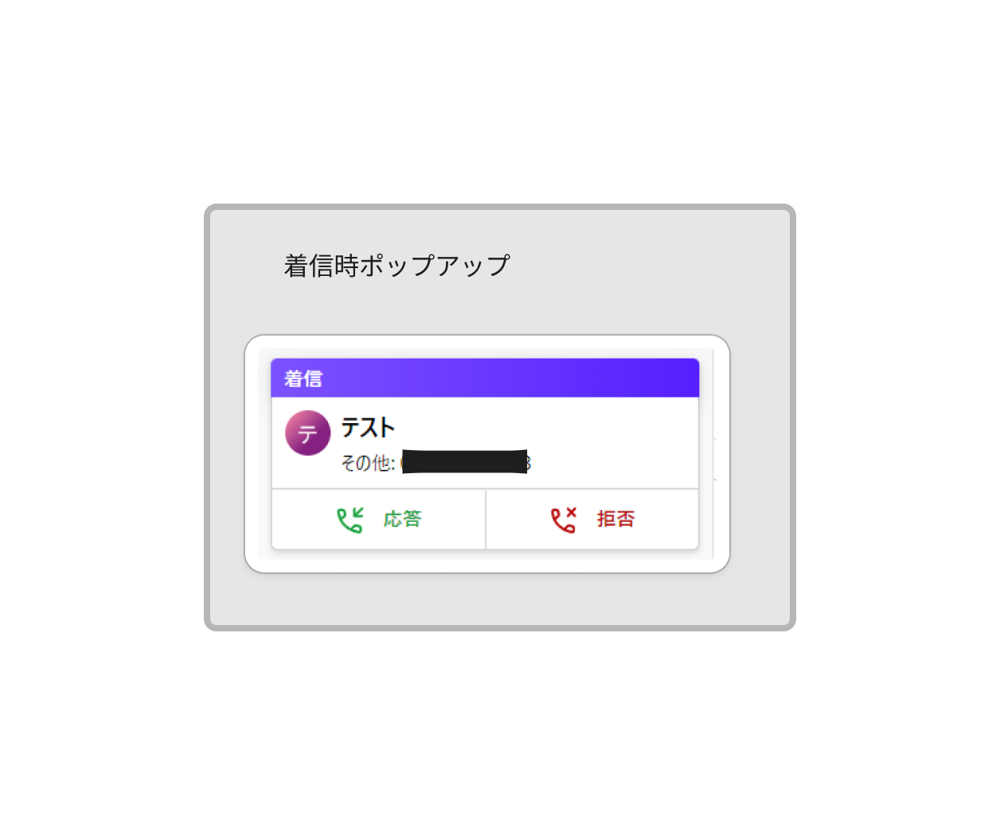
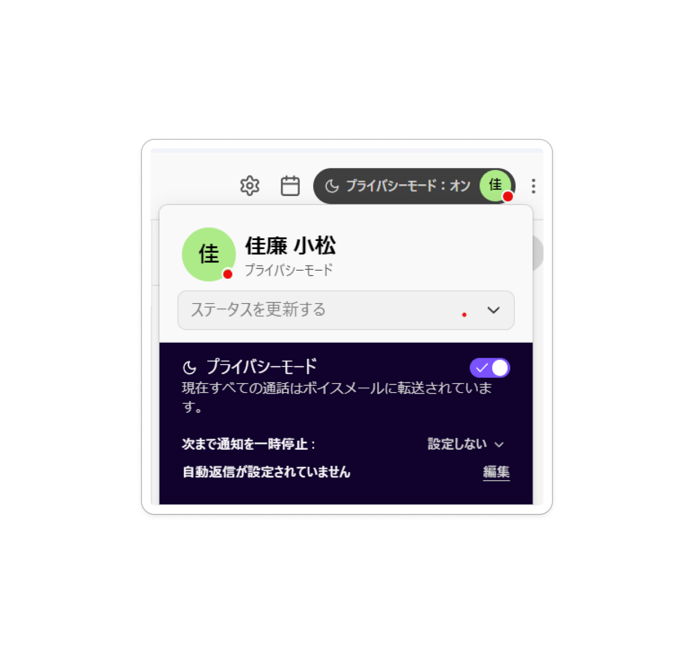

<!-- _paginate : skip -->
<!-- _class : cover -->

# IS 対応マニュアル
## 電話対応の方法

---
<!-- _header : IS 対応マニュアル IS 対応マニュアル 電話対応 -->
<!-- _class: overview sm -->

## 目次

- [Dialpadについて](#dialpad)
- [LINKEY商材の導入検討の場合](#linkey)
- [LINKEY以外の商材導入検討の場合](#other)
- [ユーザーからのサポートの場合](#support)
- [ユーザーからの契約関連の問い合わせの場合](#contract)

---
<!-- _header : IS 対応マニュアル IS 対応マニュアル 電話対応 > Dialpad について-->
<!-- _class: sm image-h400 -->

## Dialpadについて

電話対応は全てクラウド電話ツール「Dialpad」で行う。
受付時間は平日10:00~17:00。
受付時間外や対応者不在時は通話相手へボイスメッセージが流れ、着信は来ない設定。

### 着信時

着信があり次第、「応答」押下し対応。

---
<!-- _header : IS 対応マニュアル IS 対応マニュアル 電話対応 > Dialpad について-->

### 通話時

通話中になると自動でHubspot画面に遷移し、電話番号が入力されたコンタクトレコードが自動作成される。
既に作成済みのレコードの場合は、該当のレコード画面が自動で表示される。

---
<!-- _header : IS 対応マニュアル IS 対応マニュアル 電話対応 > Dialpad について-->

### 通話中

通話中メモは、Hubspot内の「コール」 ＞「コールのログを記録」に入力するとそのまま保存できておすすめ。
通話中「ミュート／保留／転送／キーパッド／ゲストを追加する／その他」を選択できる画面が表示されるが、現状使うのは「保留」のみ。
他の担当者からの連絡が必要な時は、担当者より改めて折り返す旨お伝えし終話する。

---
<!-- _header : IS 対応マニュアル IS 対応マニュアル 電話対応 > Dialpad について-->
<!-- _class: image-h400 -->

### 休憩中や離席時

右上の名前アイコンを押し、プライバシーモードONにする。

### 不在着信やボイスメッセージがあった時

全てアプリ上に記録が残るため、確認次第、折り返し電話する。

---
<!-- _header : IS 対応マニュアル IS 対応マニュアル 電話対応 > Dialpad について-->

### グループについて

グループ（Wix／コーポ／ペラ／新Web）に各々番号を設定しているため、どのサイトの電話番号からかけてきたかが分かるようになっている。
Wixとペラについては現在、サイトを閉じているため基本的にかかってくることはない。

### 録音機能について

基本的に全ての通話が録音される仕様。
Hubspot上でも録音が残るようになっている。
ただし、録音の視聴期限あり。

---
<!-- _header : IS 対応マニュアル IS 対応マニュアル 電話対応 > LINKEY商材の導入検討の場合-->

## LINKEY商材の導入検討の場合

### 対応の流れ

1. お客さま情報・検討状況のヒアリング
1. コールにログを記録
1. プロパティ更新
1. 必要あれば会社レコード作成
1. メール送信
1. タスク処理
1. Trelloカード更新

---
<!-- _header : IS 対応マニュアル IS 対応マニュアル 電話対応 > LINKEY商材の導入検討の場合-->
<!-- _class: sm -->

### 1.お客さま情報・検討状況のヒアリング

電話問い合わせでは、製品への関心度が高いお客さまが多い。
電話時に可能な限り情報を引き出し、ヒアリングする。

最低限、下記情報は聞きたい。慣れてきたら、より詳細な検討状況ヒアリングをしていく。

- 会社名
- お名前（必須）
- メールアドレス（必須）
- 導入希望台数
- 導入予定の物件所在地
- 当社での施工手配のご希望有無

> スニペットで「電話ヒアリング_トークスクリプト」を設定しているため、”#call_talk”を活用しながら電話対応を行うと良い。

---
<!-- _header : IS 対応マニュアル IS 対応マニュアル 電話対応 > LINKEY商材の導入検討の場合-->

### 2.コールにログを記録

Hubspot内「コール」に電話内容をもれなく入力する。
後から誰が見返しても、どのような内容の電話応対をしたのかテキストで確認できるように。Hubspotでの情報一元化のためでもある。

---
<!-- _header : IS 対応マニュアル IS 対応マニュアル 電話対応 > LINKEY商材の導入検討の場合-->

|項目|入力方法・説明|
|-|-|
|説明|通話ログとなるため、会話内容をすべて書き出して記録。 質問があった場合はQ&Aそれぞれ入力。案内済みの項目についても書く。|
|成果|- 話し中 - 接続済み - 伝言を残した - 留守電を残した - 応答なし - 番号間違い  から該当のものを選択。一次対応時は「接続済み」になることが多い。|
|方向|- 着信 - 発信  から該当のものを選択。 先方より着信があったか、自分から発信したかで判断。一次対応時は「着信」になることが多い。|

---
<!-- _header : IS 対応マニュアル IS 対応マニュアル 電話対応 > LINKEY商材の導入検討の場合-->

### 3.プロパティ更新

コンタクトレコードの下記セクション内のプロパティを更新する。

- このコンタクトの概要
- 問い合わせ基本情報
- 問い合わせ内容詳細
- ヒアリング事項
- 見積もり情報

各セクション・プロパティの入力ルールは[こちら](https://docs.google.com/document/d/1r7fNILlrSG4xram_D-H_yWUVuaJSOS5fATU5Q5cnhMk/edit?usp=sharing)。
ヒアリング事項や見積もり情報についても分かることが多いので、全てもれなく入力すること。

---
<!-- _header : IS 対応マニュアル IS 対応マニュアル 電話対応 > LINKEY商材の導入検討の場合-->
<!-- _class: sm -->

### 4.必要あれば会社レコード作成

一次対応方法セクションで説明済みのため割愛。

### 5.メール送信

#### 手順

- 割り当てられたタスクの内容を確認する。
    例：「一次対応_資料確認依頼 メール送信」

- 該当のメールテンプレを選択。
    「Eメール」 > 右側の「Eメールを作成」 > Eメール作成画面の左上にある「テンプレート」 > 「LINKEY IS 一次対応（資料あり）」 > 「一次対応 I - 資料・価格案内（電話問い合わせ）」テンプレート選択。

- その他電話応対時に、お客様よりいただいた質問の回答や資料案内が必要な場合は、随時メールに追加する。
- メール内容に不備がないことを確認のうえ「送信」

---
<!-- _header : IS 対応マニュアル IS 対応マニュアル 電話対応 > LINKEY商材の導入検討の場合-->

### 6.タスク処理

一次対応方法セクションで説明済みのため割愛。

### 7.Trelloカード更新

[こちら](https://docs.google.com/document/d/1DRouAwQC5op5pLMc9HhXiXacVwaKiEQ9bJUKe60iL4A/edit?usp=sharing)で説明。

---
<!-- _header : IS 対応マニュアル IS 対応マニュアル 電話対応 > LINKEY以外の商材導入検討の場合-->

## LINKEY以外の商材導入検討の場合

### 対応の流れ

- お客さま情報・問い合わせ内容のヒアリング
- コールにログを記録
- プロパティ更新
- 必要あれば会社レコード作成
- Gmailで対応依頼メール送信
- Trelloカード更新

---
<!-- _header : IS 対応マニュアル IS 対応マニュアル 電話対応 > LINKEY以外の商材導入検討の場合-->

### 1.お客さま情報・問い合わせ内容のヒアリング

下記項目をヒアリングし、担当者より折り返す旨お伝えし終話。

- 導入検討サービス
- 業種
- 会社名
- 担当者名
- 会社所在地
- 電話番号
- メールアドレス

---
<!-- _header : IS 対応マニュアル IS 対応マニュアル 電話対応 > LINKEY以外の商材導入検討の場合-->
<!-- _class: sm -->
### 2.コールにログを記録

Hubspot内「コール」に電話内容を簡単に入力する。

|項目|入力方法・説明|
|-|-|
|説明|通話ログとなるため、会話内容をすべて書き出して記録。 質問があった場合はQ&Aそれぞれ入力。案内済みの項目についても書く。|
|成果|- 話し中 - 接続済み - 伝言を残した - 留守電を残した - 応答なし - 番号間違い  から該当のものを選択。一次対応時は「接続済み」になることが多い。|
|方向|- 着信 - 発信  から該当のものを選択。 先方より着信があったか、自分から発信したかで判断。一次対応時は「着信」になることが多い。|

---
<!-- _header : IS 対応マニュアル IS 対応マニュアル 電話対応 > LINKEY以外の商材導入検討の場合-->

### 3.プロパティ更新

コンタクトレコードは下記2つのセクションのみの更新で良い。

- このコンタクトの概要
- 問い合わせ基本情報

各セクション・プロパティの入力ルールは[こちら](https://docs.google.com/document/d/1r7fNILlrSG4xram_D-H_yWUVuaJSOS5fATU5Q5cnhMk/edit?usp=sharing)。

---
<!-- _header : IS 対応マニュアル IS 対応マニュアル 電話対応 > LINKEY以外の商材導入検討の場合-->

### 4.必要あれば会社レコード作成

一次対応方法セクションで説明済みのため割愛。

---
<!-- _header : IS 対応マニュアル IS 対応マニュアル 電話対応 > LINKEY以外の商材導入検討の場合-->
<!-- _class: sm -->
### 5.Gmailで対応依頼メール送信

下記内容でGmail送信。

To: sales.1@ume-hiakri.net
Cc: marketing@ume-hikari.net

[対応依頼] {サービス名}新規問い合わせ {会社名} {姓}さま

セールス各位　
Cc：マーケ各位

お疲れ様です。{自分の名前}です。
先ほど{チャネル名}電話問い合わせにて下記お客様よりご連絡がありました。
[Hubspotレコード](#)作成済みです。※Hubspotリンク添付

■ 導入検討サービス：
■ 業種：

■ 会社名：
■ 担当者名：さま
■ 会社所在地：
■ 電話番号：
■ メールアドレス：
■ メモ：
■ 対応依頼内容：

ご確認のうえご対応のほどよろしくお願いいたします。

---
<!-- _header : IS 対応マニュアル IS 対応マニュアル 電話対応 > LINKEY以外の商材導入検討の場合-->

### 6.Trelloカード更新

他セクションで説明済みのため割愛。

---
<!-- _header : IS 対応マニュアル IS 対応マニュアル 電話対応 > ユーザーからのサポートの場合 -->

## ユーザーからのサポートの場合

### ①かけ直しご希望の場合

#### 対応の流れ

1. LINKEY専用カスタマーサポートセンターの番号をお伝えし終話
1. LINKEYカスタマーセンター 0120-280-810（365日、24時間受け付け）

---
<!-- _header : IS 対応マニュアル IS 対応マニュアル 電話対応 > ユーザーからのサポート希望の場合 -->

### ②折り返しご希望の場合

#### 対応の流れ

1. 下記項目をヒアリングし担当者より折り返す旨お伝えし終話。
    - 名前
    - 電話番号
    - 問い合わせ内容
2. 下記内容の対応依頼メールをGmailにて送信

---
<!-- _header : IS 対応マニュアル IS 対応マニュアル 電話対応 > ユーザーからのサポート希望の場合 -->

To: fine.cs@ume-hikari.net
Cc: planning.development@ume-hikari.net, marketing@ume-hikari.net

[対応依頼] LINKEY サポートご希望 {会社名} {姓}さま

テクサポ各位
(Cc 企画開発各位、マーケ各位)

お疲れ様です。{自分の名前}です。
LINKEY をご利用の方よりサポートご希望の問い合わせをいただきました。

■ 氏名：
■ 電話番号：
■ 問い合わせ内容：

ご確認とご対応のほどよろしくお願いいたします。

---
<!-- _header : IS 対応マニュアル IS 対応マニュアル 電話対応 > ユーザーからのサポート希望の場合 -->

## ユーザーからの契約関連の問い合わせの場合

### 対応の流れ

1. 下記項目をヒアリングし担当者より折り返す旨をお伝えし終話。
    - 名前
    - 電話番号
    - 問い合わせ内容
2. 下記内容の対応依頼メールをGmailにて送信

---
<!-- _header : IS 対応マニュアル IS 対応マニュアル 電話対応 > ユーザーからのサポート希望の場合 -->

To: general@ume-hikari.net
Cc: planning.development@ume-hikari.net, marketing@ume-hikari.net

[対応依頼] LINKEY 契約関連のお問い合わせ {会社名} {姓}さま

総務部各位
(Cc 企画開発各位、マーケ各位)

お疲れ様です。{自分の名前}です。
LINKEY をご利用の方より 契約関連の問い合わせをいただきました。

■ 氏名：
■ 電話番号：
■ 問い合わせ内容：

ご確認とご対応のほどよろしくお願いいたします。

---
<!-- _class: cover -->

# おしまい

