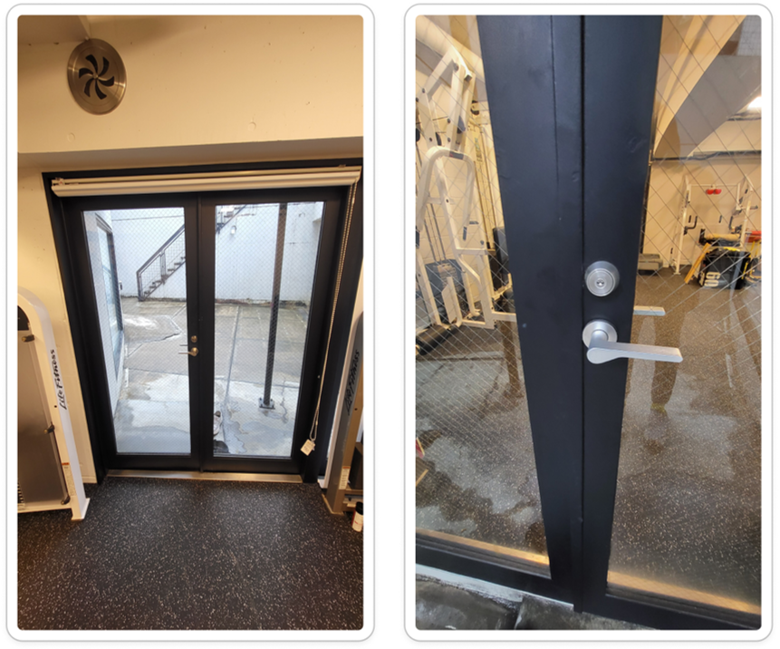
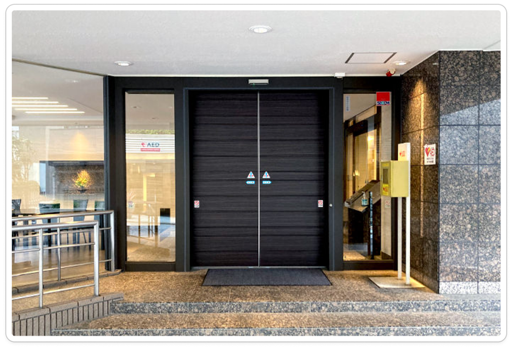
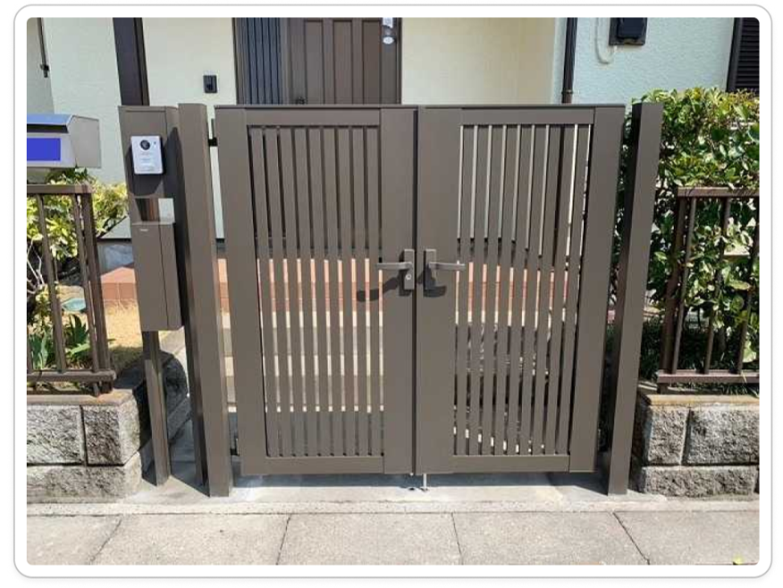
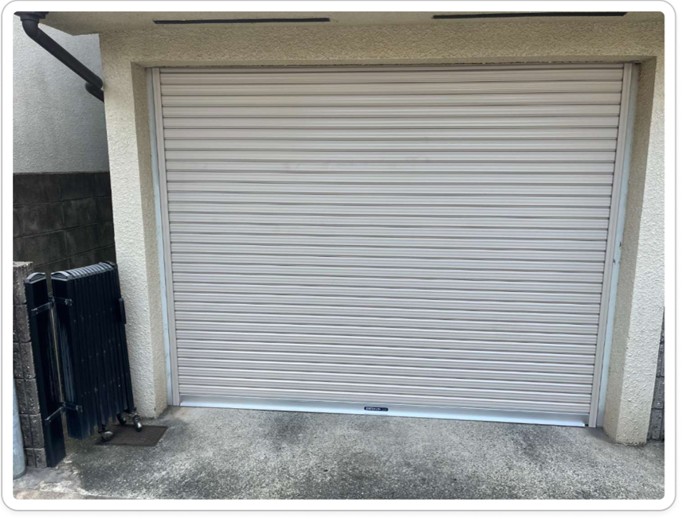
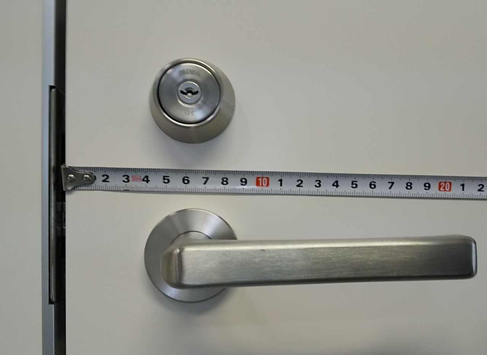
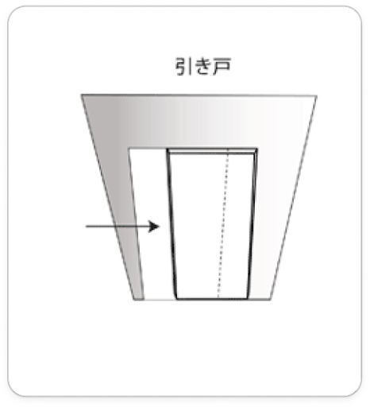
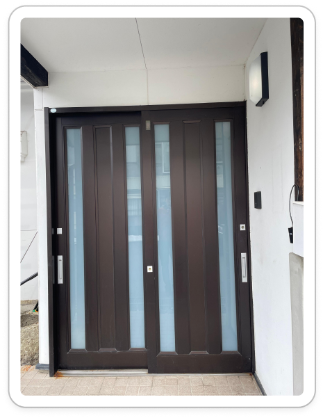

<!-- _paginate : skip -->
<!-- _class : cover -->

# IS 対応マニュアル
## 施工診断方法

---
<!-- _header : IS 対応マニュアル IS 対応マニュアル 施工診断 -->
<!-- _class: overview -->

## 目次

- [施工診断とは](#intro)
- [簡易診断方法](#quick)
- [お断りする場合](#breakup)
- [施工診断方法](#steps)
- [施工診断回答方法](#answer)

---
<!-- _header : IS 対応マニュアル IS 対応マニュアル 施工診断 > 施工診断とは -->

## 施工診断とは

お客さまよりいただいたドア・錠前写真を基に、LINKEY Plusの適合可否や施工条件を診断し、結果を連絡すること。

ISでは、簡易診断→施工診断→施工診断回答の流れで対応する。

全てHubspotのプロパティや自動化WFで作成されるタスク処理で対応できる仕組みになっているため、本マニュアルではその対応方法を説明する。

---
<!-- _header : IS 対応マニュアル IS 対応マニュアル 施工診断 > 簡易診断方法 -->

## 簡易診断方法

施工診断の最初のステップは、簡易診断を行うこと。

### 手順

1. 送られてきたドア・錠前の写真を確認し、「施工診断に進めるか」or 「お断り(Break-up)するか」のいずれかに判別する。
2. コンタクトレコードの 「簡易診断結果」 プロパティを該当の値に更新する。

---
<!-- _header : IS 対応マニュアル IS 対応マニュアル 施工診断 > 簡易診断方法 -->

扉を取り替えるレベルの工事をしない限り、取り付けられない場合には、「お断り(Break-up)する」と判断する。

それ以外の多くのケースでは、「施工診断に進める」と判断する。なので、この簡易診断は甘めの合格基準で判定をする。

具体的なケースは次ページで説明する。

---
<!-- _header : IS 対応マニュアル IS 対応マニュアル 施工診断 > 簡易診断方法 -->
<!-- _class: sm -->

### お断り(Break-up)するケース

- 框ドアかつバックセットが明らかに足りない
- 框ドアであってもバックセット寸法が足りるものは施工診断に進めるので注意。
- エントランス自動スライドドア
- 門扉、シャッターやロッカーの錠前
- 扉厚が 33 mm に満たない

---
<!-- _header : IS 対応マニュアル IS 対応マニュアル 施工診断 > 簡易診断方法-->
<!-- _class: sm -->

### 施工診断に進めるケース

- 基本的に前ページに当てはまらないドアは全て施工診断に進めるという認識。
- 問題なくLINKEY Plus取り付けができそうなドア
- 片引き戸、引き違い戸
- 電気錠
- その他の不適合錠前のドア

---
<!-- _header : IS 対応マニュアル IS 対応マニュアル 施工診断 > お断りする場合 -->

## お断り (Break-up) する場合

### 手順

- 簡易診断結果（WF）プロパティを「Break-upする」に変更。
- Eメールを作成＞テンプレート＞「LINKEY IS 追客・その他」フォルダ選択＞「Break-up(施工条件不適合)」テンプレート選択。
- メール文を調整。框ドアと引き戸ドアの案内がどちらも記載されているため、必要に応じて削除し、調整する。
- メール内容に問題がないことを確認し、送信。

---
<!-- _header : IS 対応マニュアル IS 対応マニュアル 施工診断 > 施工診断方法-->

## 施工診断方法

簡易診断で施工診断に進める案件は、この手順で対応する。

### 手順

1. 簡易診断結果（WF）プロパティを「施工診断に進める」に変更
1. 写真データ整理
1. 施工条件セクション入力

---
<!-- _header : IS 対応マニュアル IS 対応マニュアル 施工診断 > 施工診断方法-->

### 2.写真データ整理

写真データは全て、[こちら](https://drive.google.com/drive/folders/1SAnkhs7dCTtnnuHcerBOdjLM6Q4XvAl6)のGoogleDriveに保存する。

#### 手順

1. Drive内、該当のメーカーのフォルダを選択。ex.10_MIWA
1. フォルダを新規作成。フォルダ名は「会社名 姓さま メーカー型番」とする。ex.株式会社テスト 小松さま MIWA13LA
1. 新規作成したフォルダ内に、リードよりいただいたドア写真を全て格納。
1. 画像名を分かりやすく変更。ex.室内側.jpg/室外側.jpg/側面.jpg/室外側全景.jpg
1. フォルダ名をクリック or 右クリック ＞共有＞リンクをコピー＞ドア錠前写真DriveURLプロパティにペースト

---
<!-- _header : IS 対応マニュアル IS 対応マニュアル 施工診断 > 施工診断方法-->

### 3.施工条件セクション入力

- 施工条件セクションの各プロパティに該当の値を選択。

各セクション・プロパティの入力ルールは[こちら](https://docs.google.com/document/d/1r7fNILlrSG4xram_D-H_yWUVuaJSOS5fATU5Q5cnhMk/edit?tab=t.0#heading=h.h9wdikxhb70d)。

---
<!-- _header : IS 対応マニュアル IS 対応マニュアル 施工診断 > 施工診断方法-->

#### 補足

診断進捗（WF）プロパティが「完了」になると、施工診断回答タスクが自動で作成される。誤って完了にしてしまった場合は、下記の手順でやり直すことが可能。

1. 自動作成された「施工診断回答」タスクを削除
1. 診断進捗（WF）プロパティを「写真で施工診断中」に変更
1. 誤った入力プロパティを正しい値に変更＞必ず保存
    ※保存を押さないと自動化WFの発動条件がリセットされない
1. 診断進捗（WF）プロパティを「完了」に変更＞保存

---
<!-- _header : IS 対応マニュアル IS 対応マニュアル 施工診断 > 施工診断回答方法-->

## 施工診断回答方法

### 手順

1. 施工診断回答タスクを確認
1. 確認依頼コメント
1. （必要あれば）企画開発へ確認メール送信
1. 確認後、施工診断回答メール送信

---
<!-- _header : IS 対応マニュアル IS 対応マニュアル 施工診断 > 施工診断回答方法-->

### 1.施工診断回答タスクを確認

施工条件セクションの値を基に、自動で施工診断回答タスクが作成される。
さらにタスクの説明欄には、施工に関する案内文も自動で挿入される。
その案内文をリードへお伝えするため、内容に誤りがないか念のため確認。

> ex. ■ バックセット寸法に余裕が～
> ■ 適合錠前への交換や適合錠前の新規～等

---
<!-- _header : IS 対応マニュアル IS 対応マニュアル 施工診断 > 施工診断回答方法-->

### 2.確認依頼コメント

施工診断回答タスクのコメントから、下記内容での確認依頼を小松あてにメンションする。

> @小松 佳廉
> 自己診断が完了しました。
> ご確認お願いいたします。

---
<!-- _header : IS 対応マニュアル IS 対応マニュアル 施工診断 > 施工診断回答方法-->

### 3.（必要あれば）企画開発へ確認メール送信

企画開発への確認が必要なドア・錠前の場合は、Gmailにて確認依頼メールを送信する。

メールテンプレは別途共有する。

施工診断お願いしますと丸投げではなく、自己診断の内容と何が不明で何を聞きたいのかを明確にしたメール内容にする。

---
<!-- _header : IS 対応マニュアル IS 対応マニュアル 施工診断 > 施工診断回答方法-->

### 4.確認後、施工診断回答メール送信

小松または企画開発の確認完了次第、リードへ施工診断の回答メールを送信する。

#### 手順

1. Eメールを作成＞テンプレート＞「LINKEY IS 追客・その他」フォルダ選択＞「施工診断回答」テンプレート選択。
1. “以下、診断結果の回答になります。”の下に、施工診断回答タスクの説明欄に記載されている施工案内文をコピペ。
1. メール内容に問題がないことを確認し、送信。

---
<!-- _class: cover -->

# おしまい

