<!-- _paginate : skip -->
<!-- _class : cover -->

# マーケティング部 2024.11 新体制企画 ブリーフィング

<!-- ### マーケティング部 栗原 -->
## 2024.9.2 Mon

---
<!-- _header : マーケ新体制案 > 目次 -->
<!-- _class: overview -->

## 目次

- [概要](#overview)
- [役割分担・業務内容](#roles)
- [連携・運用の例](#cases)
- [スケジュール](#schedule)

---
<!-- _header : マーケ新体制案 > 2 チームに分割 -->
<!-- _class: sub -->

## 概要

- 2 チームに分割
- メリット・目的
- 基本ポリシー
- Values

---
<!-- _header : マーケ新体制案 > 2 チームに分割 -->

## 2 チームに分割

以下の 2 チームに分割する。

### 1. Strategy & Creative チーム (S & T)
### 2. Data & Performance チーム (D & P) 

---
<!-- _header : マーケ新体制案 > メリット・目的 -->
<!-- _class: sm  -->

## メリット・目的

### 役割分担で効率 UP

(ある程度) 専門業務に (ある程度) 特化。
餅は餅屋。

また、同じような業務を並行して別々の人がやるとナレッジが共有できずもったいない。

### メンバー間の連携向上

施策の属人化を防ぐ。
専門業務は属人化をする。
専門業務外の仕事は他人に頼る。

### 機動力 UP

会議や打ち合わせに出る人間の数を最小にする。
それぞれ自分の業務に関連性の高い会議のみに参加する。

---
<!-- _header : マーケ新体制案 > 基本ポリシー -->

## 基本ポリシー

### 1 業務領域 = 1 担当

いままでは 1 施策 = 1 担当者の構図だった。
これが、今後は 1 業務領域 = 1 担当者になる。
施策ごとに役割分担をしつつ全員が関わるようになる。

---
<!-- _header : マーケ新体制案 > 基本ポリシー -->
<!-- _class: img_only_w -->


--- 
<!-- _header : マーケ新体制案 > 基本ポリシー -->

### チーム内では協働、チーム間では連携

チーム内では役割分担するものの、助けあって補完し合う。
チーム内では共同作業も当然行う。

チーム間では施策の担当フェーズが明確に線引きされる。
チーム間では基本的に共同作業は行わない。

--- 
<!-- _header : マーケ新体制案 > 基本ポリシー -->
<!-- _class: img_only_w -->


---
<!-- _header : マーケ新体制案 > Values -->

## Values

マーケティング部は、常務が掲げる以下の価値観を重んじる。
これらの価値観を具体的なアクションに移していく。

### 愛され・褒められる
### 役に立つ
### 求められる

---
<!-- _header : マーケ新体制案 > Values -->

### 愛され・褒められる

他の社員、他部署、取引先の担当者と良好な人間関係を築く。
業務以外の面でもやりとりしたいと思われるように。

#### 具体的なアクション

- 他の部署と交流する機会・露出を増やす
- 他の社員へ積極的・自発的にアプローチする
- 仕事を楽しむ！楽しんでいる人は愛される…気がする

---
<!-- _header : マーケ新体制案 > Values -->

### 役に立つ

他の社員、他部署、取引先、社会にメリットを与える。
寄せられる期待に応えて信頼を獲得していく。

#### 具体的なアクション

- 助けを求められたら協力する
- 困っている人には手を差し伸べる
- 安請け負いしない。守れる約束だけする。約束したら死守する。

---
<!-- _header : マーケ新体制案 > Values -->

### 求められる

上記 "役に立つ" 結果として達成できる。
他の社員、他部署、取引先、社会から必要とされる状態。

#### マーケ全員がこの状態になることを目指していく

---
<!-- _header : マーケ新体制案 > 役割分担・業務内容 -->
<!-- _class: sub -->

## 役割分担・業務内容

- 備考
- Strategy & Creative チーム (S & C)
- Data & Performance チーム (D & P)

---
<!-- _header : マーケ新体制案 > 役割分担・業務内容 -->

## 備考

### あくまでも案・想定

あくまでも現状の想定。
これで固定・不可変ではない。
運用をしながら少しずつ微調整していき改善、明確化していく。

### 改善は業務担当が

以下に定める業務の他、業務環境の改善はそれぞれの担当が責任を持つ。

---
<!-- _header : マーケ新体制案 > 役割分担・業務内容 > S & C -->

## Strategy & Creative チーム (S & C)

S & C の 2 つの業務の間の線引きは難しいケースが多い。
以下に定める業務内容はあくまで目安。
実際は、2 つの業務範囲は重複することもある。
共同作業が求められることが多いと想定される。

---
<!-- _header : マーケ新体制案 > 役割分担・業務内容 > S & C > Strategy 業務 -->

## Strategy 業務

マーケティング部のブレイン、司令塔。
施策の上流設計、調査、企画を担当する。

---
<!-- _header : マーケ新体制案 > 役割分担・業務内容 > S & C > Strategy 業務 -->

### 責任・役割

#### 施策の上流設計・管理

- 施策に必要な調査や探索、企画、目標設定を実施・手配する。
- 施策の進捗や問題に応じて、企画や目標設定の調整を行う。
- 施策の企画や目的について関係者に報告や共有を行う。
- 戦略立案、調査、企画に際し、関連部署と情報や意見の交換を行う。

#### ナレッジ管理

- 調査や企画の過程や結果で生じた資料や情報の管理を行う。
- 事業のマーケティングナレッジ (3C 分析、STP 分析、BP、CJ) の作成、保守、点検、管理を行う。

---
<!-- _header : マーケ新体制案 > 役割分担・業務内容 > S & C > Strategy 業務 -->

### 特に求められる資質

- 論理、クリティカル思考
- 緻密さ、周到さ
- 情報収集・管理能力
- 文書作成能力

---
<!-- _header : マーケ新体制案 > 役割分担・業務内容 > S & C > Strategy 業務 -->
<!-- _class: impact -->

### 担当

# 松島さん

---
<!-- _header : マーケ新体制案 > 役割分担・業務内容 > S & C > Creative 業務 -->

## Creative 業務

制作全般を受け持つ。
制作物には web サイト、資料、公開物、広告など、文章や画像の組み合わせでアイデアを表現するものが含まれる。

---
<!-- _header : マーケ新体制案 > 役割分担・業務内容 > S & C > Creative 業務 -->

### 責任・役割

#### 制作の手配・実施

- 戦略に基づいた制作物の企画調査、要件定義、実装手配をする。

#### 制作の進捗管理・報告

- 制作に関する予算、リソース、スケジュールを管理する。
- 制作進捗の把握と報告を行う。
- 制作に関するリスクや問題を迅速に把握し、適切な対処を講じる。
- 制作に関する関係者とのやりとりを行う。

#### 制作物やツールの管理

- 制作に関する成果物、アセット、ツールの保守点検や管理をする。

---
<!-- _header : マーケ新体制案 > 役割分担・業務内容 > s & c > creative 業務 -->

### 特に求められる資質

- 要件理解能力
- 美術的センス
- 創造性・発想力・表現力
- 制作に関する専門的スキルや知識

---
<!-- _header : マーケ新体制案 > 役割分担・業務内容 > s & c > creative 業務 -->
<!-- _class: impact -->

### 担当

# 竹居さん

---
<!-- _header : マーケ新体制案 > 役割分担・業務内容 > D & P -->

## Data & Performance チーム (D & P)

D & P は S & C と違って、2 つの業務は明確に区別される。
ただし、不在時や片一方の業務が大変な際には、他方が積極的にヘルプに入る。
2 つの業務担当で協力しながら進める必要がある仕事も考えられる (HubSpot レコードやワークフローの設計・実装など)。

---
<!-- _header : マーケ新体制案 > 役割分担・業務内容 > D & P > Data 業務 -->

## Data 業務

運用型施策のデータの収集、計測、視覚化、分析、報告、改善提案を行う。
Web 解析、広告運用、Performance 業務の計測が含まれる。
施策の現状把握や改善に極めて重要になる。

---
<!-- _header : マーケ新体制案 > 役割分担・業務内容 > D & P > Data 業務 > 責任・役割 -->

### 責任・役割

#### 計測・改善の企画

- 施策の計測を企画し、実装の手配を行う。
- 施策の運用や、計測・報告環境の整備、保守、点検、改善を企画し実施する。

#### データ視覚化・分析・報告

- 運用施策の実績を計測し、データを視覚化する。
- 傾向や予測を分析し文章化する。
- 他社や他部署に、数値関連の報告や意見交換を行う。
- 配信業務のためのリスト作成を行う。

#### 改善提案

- 実測値と目標の乖離の原因を考察し、改善策を考案して提案する。

---
<!-- _header : マーケ新体制案 > 役割分担・業務内容 > D & P > Data 業務 -->

### 特に求められる資質

- IT・技術への関心・理解
- 数値分析力
- データ表現能力
- 課題の識別、問題解決能力
- 集中力・正確性・精密性

---
<!-- _header : マーケ新体制案 > 役割分担・業務内容 > D & P > Data 業務 -->
<!-- _class: impact -->

### 担当

# 田中さん

---
<!-- _header : マーケ新体制案 > 役割分担・業務内容 > D & P > Performance 業務 -->

## Performance 業務

与えられた目標数値を達成するために、顧客対応と業務の改善を行う。
D チームの分析の元となるデータを入力する。
顧客応対を通して得られた定性的な洞察を他のチームに提供する。

---
<!-- _header : マーケ新体制案 > 役割分担・業務内容 > D & P > Performance 業務 > 責任・役割 -->

### 責任・役割

#### 顧客応対

- マーケティング施策を通して得られたリードを応対する。
- リード応対に必要な業務環境の整備、調整、保守、管理を行う。
- リード応対に関する業務改善を企画・実行し、パフォーマンスの向上を行う。

#### データ入力

- リード応対を通して得られたデータを情報管理システムに入力する。

#### 顧客洞察の共有

- リード応対を通して得られた定性的な洞察を分析して共有する。

---
<!-- _header : マーケ新体制案 > 役割分担・業務内容 > D & P > Performance 業務 -->

### 特に求められる資質

- IT 理解力
- 顧客への関心・興味
- 数字達成意欲
- ヒアリング、提案能力
- 顧客課題理解
- 商材・市場・戦略理解力

---
<!-- _header : マーケ新体制案 > 役割分担・業務内容 > D & P > Performance 業務 -->
<!-- _class: impact -->

### 担当

# 小松さん

---
<!-- _header : マーケ新体制案 > 連携・運用の例 -->
<!-- _class: sub -->

## 連携・運用の例

- LP 制作 PJ
- メディア出稿 PJ
- プレスリリース PJ
- 市場調査・商品開発提案 PJ

---
<!-- _header : マーケ新体制案 > 連携・運用の例 > LP 制作 PJ -->

## LP 制作 PJ

LP の開発・保守、また紐づく広告アカウントの運用を業者にする委託するという PJ。

### 調査・企画フェーズ
### 業者選定フェーズ
### 制作・実装フェーズ
### 運用フェーズ

---
<!-- _header : マーケ新体制案 > 連携・運用の例 > LP 制作 PJ -->
<!-- _class: image-h400 -->

## 調査・企画フェーズ

上流の企画から候補業者へのアプローチの手前まで。


<!-- ### Strategy 担当

LP 制作 PJ の企画を行う。
なぜ LP 制作が必要なのか、どういった LP が求められているのかを考えてまとめる。

### Creative 担当

Strategy を支援・補佐する。
過去に取引したところ含め、制作業者の調査やピックアップを行う。

### Data 担当

数値周りの現状をまとめて、S & C に共有する。
広告運用の要件定義を行い、Strategy 担当に提供する。

### Performance 担当

LP 制作に活かせる顧客応対上の知見や課題をまとめて S & C に共有する。
顧客対応周りの要件定義を行い、Strategy 担当に提供する。
 -->

---
<!-- _header : マーケ新体制案 > 連携・運用の例 > LP 制作 PJ -->
<!-- _class: image-h400 -->

## 業者選定フェーズ

候補業者への接触から、選定と発注を経て KO MTG まで。


<!-- ### Strategy 担当

提案依頼書の作成、提案の募集を行う。
打ち合わせに参加し、企画説明を行ったり、候補者から提案の説明を受けたりする。
集まった提案を比較精査し、委託先を選定する。
発注に関わる手続きを行い KOMTG を設定する。

### Creative 担当

Strategy 担当を補佐する。
協力して上記諸業務を進めていく。
特に、提案の制作面に関して知見を提供する

### Data 担当

先方の提案作成の参考になるデータを提供する。
GA や GAds の閲覧席の発行含め。

提案比較精査に協力する。
計測・運用の面から知見を提供する。
打ち合わせは不参加で OK。

### Performance 担当

提案比較精査に協力する。
顧客対応の面から知見を提供する。
打ち合わせは不参加で OK。 
-->

---
<!-- _header : マーケ新体制案 > 連携・運用の例 > LP 制作 PJ -->
<!-- _class: image-h400 -->

## 制作・実装フェーズ

KO MTG 後から LP の検収まで。


<!-- ### Strategy 担当

ここから Creative 担当にパスする。
場合によっては Creative を補佐。
他の PJ の調査・企画を進める。

LP 制作の上流行程で、こちらから何か情報を提供する必要がある場合は社内調査などを行う。

### Creative 担当

ここから忙しくなる。

定例会を担当する。
議事録の作成を行う。
制作の進捗を管理し報告する。
中途成果物をチェックし検証する。
問題発生時には対処する。
最終成果物を検収する。
LP 制作に関する支払い手続きを行う。

広告のトピックは Data 担当に振る。

### Data 担当

制作の下流で、データ計測環境の実装時には GA や HS のアクセス解析用のコードを手配したりする。
広告運用の企画段階で Creative から引き継ぐ。

### Performance 担当 

特にやることなし。
-->

---
<!-- _header : マーケ新体制案 > 連携・運用の例 > LP 制作 PJ -->
<!-- _class: image-h400 -->

## 運用フェーズ

LP の検収後から。

<!-- ### Strategy 担当

D & P から数値進捗の報告を受け、目標と乖離があれば修正戦略、問題が予見できれば予防戦略を企画する。

### Creative 担当

特段やることなし。
D & P からの FB により制作物の修正や調整を行う。

### Data 担当

ここから忙しくなる。
定例会に参加する。議事録参加。
業者による広告・LP 運用の進捗、問題点などを識別して対処する。
数値進捗 (広告運用実績、Web 解析、顧客対応実績) をまとめて社内関係者に定期的に報告。

### Performance 担当

新規 LP から得られたリードを対応する。
顧客対応を通して得られた知見をまとめる。
改善点や課題をまとめてマーケの他の業務担当者に共有する。 
-->

---
<!-- _header : マーケ新体制案 > 連携・運用の例 > メディア出稿 PJ -->

## メディア出稿 PJ

LINKEY Plus の露出先となるメディアを特定して出稿し運用する PJ。

### 調査・企画フェーズ
### メディア選定フェーズ
### 制作・実装フェーズ
### 運用フェーズ

---
<!-- _header : マーケ新体制案 > 連携・運用の例 > メディア出稿 PJ -->
<!-- _class: image-h400 -->

## 調査・企画フェーズ

上流の企画から候補メディアへのアプローチの手前まで。


<!-- ### Strategy 担当

PJ の企画を行う。
なぜ メディア出稿が必要なのか、どういったメディアへの露出が求められているのかを考えてまとめる。

### Creative 担当

Strategy を支援・補佐する。
過去に取引したところ含め、メディアの調査やピックアップを行う。

### Data 担当

数値周りの現状をまとめて、S & C に共有する。
メディア運用の要件定義を行い、Strategy 担当に提供する。

### Performance 担当

メディア出稿に活かせる顧客応対上の知見や課題をまとめて S & C に共有する。
顧客対応周りの要件定義を行い、Strategy 担当に提供する。 
-->

---
<!-- _header : マーケ新体制案 > 連携・運用の例 > メディア出稿 PJ -->
<!-- _class: image-h400 -->

## メディア選定フェーズ

候補メディアへの接触から、選定と発注まで。

<!-- ### Strategy 担当

提案依頼書の作成、提案の募集を行う。
打ち合わせに参加し、企画説明を行ったり、候補メディアから提案の説明を受けたりする。
集まった提案を比較精査し、出稿先メディアを選定する。
発注に関わる手続きを行う。

### Creative 担当

Strategy 担当を補佐する。
協力して上記諸業務を進めていく。
特に、提案の制作面に関して知見を提供する。

### Data 担当

先方の提案作成の参考になるデータを提供する。

提案比較精査に協力する。
計測・運用の面から知見を提供する。
打ち合わせには不参加で OK。

### Performance 担当

提案比較精査に協力する。
顧客対応の面から知見を提供する。
打ち合わせには不参加で OK。 -->

---
<!-- _header : マーケ新体制案 > 連携・運用の例 > メディア出稿 PJ -->
<!-- _class: image-h400 -->

## 制作・実装フェーズ

発注から原稿の作成・提供まで。


<!-- ### Strategy 担当

ここから Creative 担当にパスする。
場合によっては Creative を補佐。
他の PJ の調査・企画を進める。

原稿制作の上流行程で、こちらから何か情報を提供する必要がある場合は社内調査などを行う。

### Creative 担当

ここから忙しくなる。

制作の進捗を管理し報告する。
中途成果物をチェックし検証する。
問題発生時には対処する。
最終成果物を検収する。
支払い手続きを行う。

### Data 担当

データ計測の環境を整えて準備する。

### Performance 担当

特にやることなし。 -->

---
<!-- _header : マーケ新体制案 > 連携・運用の例 > メディア出稿 PJ -->
<!-- _class: image-h400 -->

## 運用フェーズ

メディアの公開後から。


<!-- ### Strategy 担当

D & P から数値進捗の報告を受け、目標と乖離があれば修正戦略、問題が予見できれば予防戦略を企画する。

### Creative 担当

特段やることなし。
D & P からの FB により原稿や画像の修正や調整を行う。

### Data 担当

メディア運用の数値進捗や問題点をまとめて定期的に社内関係者に報告。

### Performance 担当

メディアからのリード対応を行う。
顧客対応を通して得られた知見をまとめる。
改善点や課題をまとめてマーケの他の業務担当者に共有する。 -->

---
<!-- _header : マーケ新体制案 > 連携・運用の例 > プレスリリース PJ -->

## プレスリリース PJ

プレス関係者、リード、パートナー志願者からの反響を得るため、新商材、新機能の発表、他社との業務連携をを広報する PJ。

### 調査・企画フェーズ
### 制作・実装フェーズ
### 運用フェーズ

---
<!-- _header : マーケ新体制案 > 連携・運用の例 > プレスリリース PJ -->
<!-- _class: image-h400 -->

## 調査・企画フェーズ

上流の企画・調査から制作の手前まで。


<!-- ### Strategy 担当

PJ の企画を行う。
なぜ PRが必要なのか、どういった訴求が求められているのかを考えてまとめる。
稟議を通して予算を確保する。

### Creative 担当

Strategy を支援・補佐する。
社内や取引先にかけあい、PR の制作に必要な情報収集を行う。

### Data 担当

PR 運用の要件定義を行い、Strategy 担当に提供する。

### Performance 担当

プレス制作に活かせる顧客応対上の知見や課題をまとめて S & C に共有する。
顧客対応周りの要件定義を行い、Strategy 担当に提供する。 -->

---
<!-- _header : マーケ新体制案 > 連携・運用の例 > プレスリリース PJ -->
<!-- _class: image-h400 -->

## 制作・実装フェーズ

制作からプレスの公開まで。


<!-- ### Strategy 担当

ここから Creative 担当にパスする。
場合によっては Creative を補佐。
他の PJ の調査・企画を進める。

プレス制作の上流工程で必要な情報がかけていれば調査を行う。
公開に先駆け、社内通達や HP ニュースの準備を行う。

### Creative 担当

ここから忙しくなる。

プレス原稿を制作する。
テキストや画像を手配する。
制作の進捗を管理し報告する。
問題発生時には対処する。
最終成果物を決裁者に提出する。
プレスの公開・配信の手続き、設定を行う。
支払い手続きを行う。

### Data 担当

データ計測の環境を整えて準備する。

### Performance 担当

特にやることなし。 -->

---
<!-- _header : マーケ新体制案 > 連携・運用の例 > プレスリリース PJ -->
<!-- _class: image-h400 -->

## 運用フェーズ

プレスの公開・配信後から。

<!-- ### Strategy 担当

プレス関係者やパートナー希望者から問い合わせがあれば対応。
D & P から数値進捗の報告を受け、目標と乖離があれば修正戦略、問題が予見できれば予防戦略を企画する。

### Creative 担当

D & P からの FB によりプレスの修正や調整を行う。

### Data 担当

プレス運用の数値進捗や問題点をまとめて定期的に社内関係者に報告。

### Performance 担当

顧客対応を通して得られた知見をまとめる。
改善点や課題をまとめてマーケの他の業務担当者に共有する。
 -->

---
<!-- _header : マーケ新体制案 > 連携・運用の例 > 市場調査・商品開発提案 PJ -->

## 市場調査・商品開発提案 PJ

自社事業の市場を調査し、得られた知見を基に開発部に商品開発の提案を行う PJ。

### 企画・準備フェーズ
### 実行・手配フェーズ
### 分析・提案フェーズ

---
<!-- _header : マーケ新体制案 > 連携・運用の例 > 市場調査・商品開発提案 PJ -->
<!-- _class: image-h400 -->

## 企画・準備フェーズ

調査企画の完了まで。


<!-- ### Strategy 担当

PJ の企画を行う。
なぜこの PJ を行う必要があるのか、どのような調査や提案が求められているのか、どのように目的を達成していくのかを考えてまとめる。
企画に必要な簡易調査や探索を行う。
調査の実施は内製するのか、外注するのか。どういった調査支援業者・サービスが世の中にあるのか -->

<!-- ### Creative 担当

Strategy 担当を補佐する。
企画・調査をヘルプ
提案書の作成の準備をする。
提案書の形式を考える、作業工程の企画など -->

<!-- ### Data 担当

事業の現状・課題を整理して Strategy に提供する。

運用型施策 (Web サイト、 Web 広告、 IS) から得られるデータを集計・分析して現状の課題を抽出する。
そこから得られる問題点や改善点をまとめてパス。 -->

<!-- ### Performance 担当

顧客対応上の現状・課題を整理して Data や Strategy に提供する。

こういった顧客の声がある、とか
これが問題になって売れないケースが多い、とか -->

---
<!-- _header : マーケ新体制案 > 連携・運用の例 > 市場調査・商品開発提案 PJ -->
<!-- _class: image-h400 -->

## 実行・手配フェーズ

調査結果が得られるまで。


<!-- ### Strategy 担当

調査を実施する or 手配する。
内製してもよし。社外のパートナーを探して発注してもよし。
いずれにせよ、社内情報の調査は社内作業する必要がある。

調査にかかるリソース・コストなどを管理する。
調査にかかっている人的リソース、🍅 工数
お金。

調査のスケジュール・進捗や成果物を管理する。
スケジュール通りに進んでいるかどうか
スコープは企画通りに処理できているか
中途成果物を確認・精査して問題がないことを確認する
得られた情報や洞察を文書化して管理する

問題やリスクを対処する。
出てくれば
発生時には予防、対応策を考えて、関係者に相談のうえ策を実行する。

### Creative 担当

Strategy 担当を補佐する。
このフェーズでは Strategy は大分忙しいので

提案書作成の準備を進める。
下流の工程で分析をしてみないとまだ提案書の中身は作れない。
作れるところから。ガワとか。挿入画像で使うかもしれないものとか。
ツールやファイルなど、制作環境の整備。

### Data 担当

やるとこなし ?
得られた調査データの分析にヘルプ入る ?

### Performance 担当

やることなし。 -->

---
<!-- _header : マーケ新体制案 > 連携・運用の例 > 市場調査・商品開発提案 PJ -->
<!-- _class: image-h400 -->

## 分析・提案フェーズ

提案書の作成、社内提案の完了まで。


<!-- ### Strategy 担当

提案資料を作成する。
情報・洞察を整理し、分析する。

提案会を企画し実施する。
作成した提案資料を関係者に打ち合わせの場で説明して提案する。

### Creative 担当

提案資料の制作に協力する。
提案資料に画像や図形が必要であれば作成に協力する。
必要なければ OK。

### Data 担当

やることなし。

### Performance 担当

やることなし。 -->

---
<!-- _header : マーケ新体制案 > スケジュール -->

## スケジュール

2204.09 にブリーフィング (今日)。
2024.11 から正式に施行。
実務上はいつ動き出しても良い。
いま抱えている施策や案件をどうするか相談したい。

---
<!-- _header : マーケ新体制案 > スケジュール -->
<!-- _class: cover -->
# おしまい