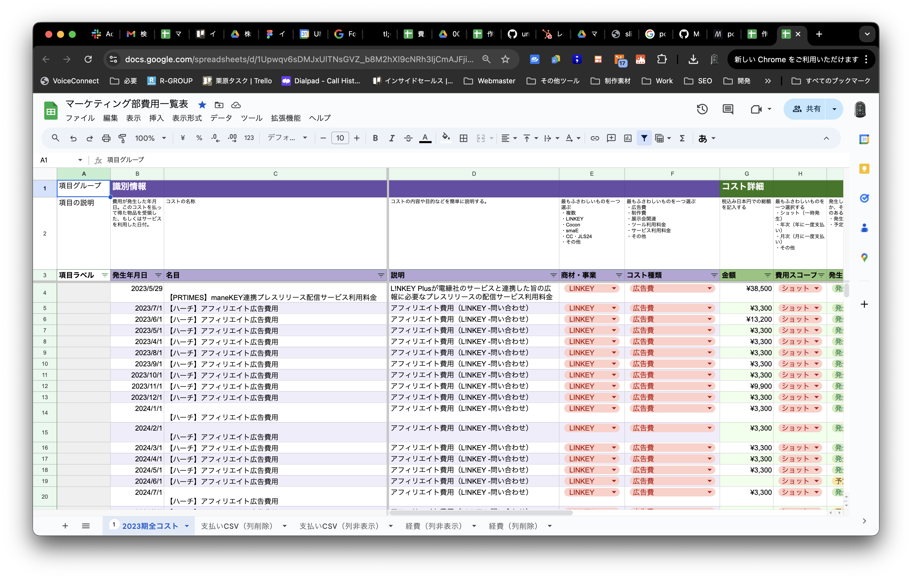

<!-- _paginate : skip -->
<!-- _class : cover -->

# マーケティング部 研修

<!-- ## マーケティング部 栗原 -->

## 2024.9.2 Mon

---
<!-- _header : マーケティング部 研修 > 研修スコープ -->
<!-- _class: lg -->

## 研修スコープ

具体的な業務とか役割・責任についてはマーケ部新体制ブリーフィングで行う。
で、具体的な業務の説明や手ほどきは別途 IS 研修を行う。

---
<!-- _header : マーケティング部 研修 > 目次 -->
<!-- _class: overview -->

## 目次

- [勤怠管理](#attendance)
- [業務管理](#admin)
- [チーム内連絡](#communication)
- [その他基幹ツール](#tools)

---
<!-- _header : マーケティング部 研修 > 勤怠管理 -->
<!-- _class: sub -->

## 勤怠管理

- 勤務開始
- 退勤
- 休憩
- 在宅ワークと出社
- 休暇

---
<!-- _header : マーケティング部 研修 > 勤怠管理 > 勤務開始-->
<!-- _class: sm -->

## 勤務開始

### 勤務開始時間

勤務開始は 9:00。

### 勤務開始連絡

9:00 前後に勤務開始連絡をする。

|項目|説明|
|-|-|
|連絡ツール|Gmail|
|宛先|To: 井出常務, Cc マーケ|
|タイトル|勤怠報告 xx 月 xx 日 (曜日) ,など|

以下のルールがあるが、それ以外は自由。

- これから勤務を開始する旨を伝える。
- アクティビティ管理シートの当該日の予定列へのリンクを挿入する。

A シートの予定列へのリンクは以下のフローで取得する。

- セルの範囲を選択
- 右クリックでコンテキストメニュー > セルでの他の操作項目を表示 > この範囲へのリンクを取得

メール本文のリンクテキストは "アクティビティ予定" など。

---
<!-- _header : マーケティング部 研修 > 勤怠管理 > 勤務開始-->

### メール例

to: t.ide@ume-hikari.net
Cc: marketing@ume-group.co.jp

【勤怠報告】2024.09.02 Mon

井出常務
(Cc マーケティング部各位)

おはようございます。栗原です。
本日の勤務を開始いたします。

[アクティビティ予定](./#)

本日もどうぞよろしくお願いいたします。

---
<!-- _header : マーケティング部 研修 > 勤怠管理 > 勤務開始 -->

### ジョブカン

9:00 の勤務開始に間に合うようにボタンを押す。

タブを開きっぱなしにしている場合は、押す前にページをリフレッシュする。
そうしないとログアウトしてしまっていて、ボタンを押したのに反映されていないことがある。

---
<!-- _header : マーケティング部 研修 > 勤怠管理 > 退勤 -->

## 退勤

### 退勤時間

退勤は 18:00。
残業は基本的に禁止。
止むを得ない場合は、事前に栗原から了承を得た上でジョブカンにて残業申請を行う。

### 翌勤務日の A シートの準備

アクティビティ管理シートに、翌日のアクティビティ予定を作成する。
アクティビティの予定ステータスは "予定"、実行ステータスは "" (ブランク) にする。
アクティビティの件数は 13 件を目標に設定する。

---
<!-- _header : マーケティング部 研修 > 勤怠管理 > 退勤-->

### A シートに日次ログを記述する

マーケティング部管理シートの "日次ログ" シートに日次ログを記述する。
その日に実際に処理したアクティビティ数 = 🍅数を、"実施🍅数" に記載する。

---
<!-- _header : マーケティング部 研修 > 勤怠管理 > 退勤-->
<!-- _class: sm -->

### 日報

18:00 ちょうど、もしくは後に日報を送る。

|項目|説明|
|-|-|
|連絡ツール|Gmail|
|宛先|To: 井出常務, Cc マーケ|
|備考|勤務開始報告メールと同じスレッドで送る (返信する)|

以下のルールがあるが、それ以外は自由。

- 当日の勤務を終える旨を記載する
- A シートの当該日のセル範囲へのリンクを挿入する。
- 日次ログの当該日のセル範囲へのリンクを挿入する。

A シート、日次ログのセル範囲のリンクは勤務開始同様。
メール本文に挿入する日次ログのリンクテキストは "日次ログ" など。

---
<!-- _header : マーケティング部 研修 > 勤怠管理 > 勤務開始-->

### メール例

to: t.ide@ume-hikari.net
Cc: marketing@ume-group.co.jp

Re: 【勤怠報告】2024.09.02 Mon

井出常務
(Cc マーケティング部各位)

お疲れ様です。栗原です。
本日の勤務を終了いたします。

[アクティビティ実績](./#)
[日次ログ](./#)

明日もどうぞよろしくお願いいたします。

---
<!-- _header : マーケティング部 研修 > 勤怠管理 > 退勤-->

### 翌勤務日の勤務開始メールの下書きを作っておく

作っておけば、翌勤務日の朝にドタバタしないで済むのでラク。

### ジョブカン

ジョブカンは退勤時間前には押さない。
退勤時間ちょうど、もしくはそのちょっと後に押す。

---
<!-- _header : マーケティング部 研修 > 勤怠管理 > 休憩-->

## 休憩

休憩は 1 時間必ず取る。
ポモドーロ間のショート & ロングブレイクとは別に。

1 時間まとめてとるのが望ましい。
30 min x 2 とかに分割しても OK。

休憩開始時間は、1 日のうちどこにしても OK。
GCal に休憩時間を入れておく。

---
<!-- _header : マーケティング部 研修 > 勤怠管理 > 在宅ワークと出社-->

## 在宅ワークと出社

基本マーケは全員在宅。
会社のイベントや業務の都合で出社が求められる時もある。

地方のフルリモートメンバーを除き、首都圏組は GCal で勤務地を "自宅" に設定しておく。
出社する場合、GCal 上で勤務地を "オフィス" に設定する。
移動時間は勤務時間外に行う。

また、午前は在宅、午後は出社など、1 日で在宅と出社を組み合わせるのは NG。
出社日は 1 日出社する。

---
<!-- _header : マーケティング部 研修 > 勤怠管理 > 休暇-->

## 休暇

基本休みはカレンダー通り。
土日祝の勤務はなし。

他のマーケメンバーが分かるように、GCal 上で当該日には "不在" を設定する。

### 有休

最低消化日数分の消化はマスト。
自身の有休消化進捗は自己管理する。ジョブカンや出勤簿に載ってるはず。

自由に取って良い。
全休、半休の振り分けも自由。
休む日に先駆けて Trello の勤怠連絡カードからマーケメンバーに事前連絡する。

---
<!-- _header : マーケティング部 研修 > 勤怠管理 > 休暇-->

### 夏休み

3 日間支給される。
お盆休みや長期休暇は、有休や祝日と組み合わせて自由に取ってよい。

### 年末年始

毎年 12.28 あたりから 翌年 1.4 くらいまで休み。

---
<!-- _header : マーケティング部 研修 > 業務管理 -->
<!-- _class: sub sm -->

## 業務管理

<!-- 具体的な業務の取り組み方は業務ごとに異なる。
ここではすべての業務に共通した業務管理一般について説明。 -->

- ポモドーロ
- A シート
- DSM
- ドキュメント管理
- 請求・経費管理

 

- 1 on 1 MTG
- マーケティング部月次定例会
- その他ルーティン
- 自習・スキルアップ

---
<!-- _header : マーケティング部 研修 > 業務管理 > ポモドーロ -->
<!-- _class: image-h300 -->

## ポモドーロ

作業時間・タスク管理のテクニック。
ポモドーロ・タイマーというツールを使う。

---
<!-- _header : マーケティング部 研修 > 業務管理 > ポモドーロ -->

### ポモドーロ・テクニックの概要

25 分間の作業 + 5 分間の休憩 (ショート・ブレイク) を 1 セットにして 1 ポモドーロ (1 🍅) とする。
4 セット目の休憩は 最低 15 分とる (ロング・ブレイク)。
それを 1 日の勤務時間中繰り返していく。

### メリット

これにより、集中力が高まり生産性が高まる。
また、適度に小休憩が挟まるので燃え尽きや疲労も防げる。
さらに、1 🍅を作業時間の単位にできるので、タスクにかかる時間の見積もりや、実際にかかった時間の算出が楽になる。

---
<!-- _header : マーケティング部 研修 > 業務管理 > ポモドーロ -->

### ポモドーロ・タイマー

物理タイマーとデジタルタイマーがある。
どんなツールを使っても良い。
デジタルツールを使う場合、どんな作業を PC でしていても常にカウントダウンが見れるようにしておく。
現状メンバーからは [Focus ToDo](https://www.focustodo.cn/) の評価が高い。

PC 版、スマホ版、どちらのアプリでも良い。

---
<!-- _header : マーケティング部 研修 > 業務管理 > ポモドーロ -->

### ルール 1: 1 つの仕事に専念する

1 つの🍅中は、雑多な業務を行わない。かならず 1 つの業務に専念する。

🍅中は中断を極力避ける。
メールに返信したり、トイレに離席したりしない。
超クイックに終わる返信やリアクションは OK。むしろ推奨。
返信に数分かかるようなやり取りは行わない。
それらは🍅後のブレイクで行う。
簡単なメールやチャットのチェックであれば問題ない。

---
<!-- _header : マーケティング部 研修 > 業務管理 > ポモドーロ > ルール -->

25 分に満たずに作業が終わった場合は、
- 作業を見直したり、磨き上げたりする
- MA (下記参照) を処理する
- 後続作業の準備をする
などに使う。

---
<!-- _header : マーケティング部 研修 > 業務管理 > ポモドーロ > ルール -->

### ルール 2: ブレイクを適切にとる

ショート・ブレイクは 5 分。それ以上長くとるとリズムに乗れない。
それ以上取りたい場合は過度に集中しすぎ or 疲れている証拠なので、ロング・ブレークをとる。

ロング・ブレイクは最低 15 分。それ以上とっても良い。
ただし、あまり長く取りすぎるとそれもリズムが崩れる。現実的には 25 分くらいが上限か。

ひとつの目安として、疲れてきたり、気が散ってきたらロング・ブレイクを長めに取る合図。

---
<!-- _header : マーケティング部 研修 > 業務管理 > ポモドーロ > ルール -->

### ルール 3: タイマーがなったら作業をすぐやめる

🍅完了のタイマーが鳴ったら作業を終える。
もう少しで切りが良いところまで終わる、という場合は数分を目安に作業を延長してもいい。

###  ルール 4: 細かい作業は 1 🍅にまとめる

完了するのに 25 分に満たない作業はマイクロ・アクティビティ (MA) と呼ぶ。
これらは寄せ集めて、1 つの🍅でまとめて終わらせる。
1 日に 1 🍅を目安に MA 処理専用の 🍅 を設定しておくと良い。

---
<!-- _header : マーケティング部 研修 > 業務管理 > A シート -->

## A シート

[マーケティング部管理シート](https://docs.google.com/spreadsheets/d/1v9nhHv8XXbMQoGk8BUQVM3Trb5Hy5UVQhjANkdMgzRk/edit?usp=sharing)という Google Spreadsheet がある。
マーケ部では、全員の作業をこのシートで記録したり、予定の管理をしている。

SS 内の "アクティビティ" とう名前のタブのシートがアクティビティ管理シート。

テーブルの構成になっている。
1 列 = 1 🍅。
行を構成している項目は以下に説明する。

---
<!-- _header : マーケティング部 研修 > 業務管理 > A シート -->
<!-- _class: img_only_h -->

---
<!-- _header : マーケティング部 研修 > 業務管理 > A シート -->

### 日付

予定段階では、アクティビティを行う予定日。
予定取り実施した場合は実施日になる。

### 担当

自分の名前をドロップダウンから選択する。
自分のアクティビティは自分で予定・記録する。

### 指数

その日のアクティビティの番号・個数を表す整数。
日付を入れれば自動で値が振り分けられる。
この数字と、右のエラーチェックを確認して、日次ログシートに "実施🍅数" を記載する。

---
<!-- _header : マーケティング部 研修 > 業務管理 > A シート -->

### エラーチェック

アクティビティの記載のエラーの有無を表す。
自動で値が振り分けられる。

"実行ステータス" が "完了" になっている場合、エラーの有無の判断が行われる。

- "作業内容" と "アウトプット" のいずれかが空白だとエラー。
- "作業内容" に記入されているテキストのカウントが 20 以下だとエラー。

---
<!-- _header : マーケティング部 研修 > 業務管理 > A シート -->
<!-- _class: sm -->

### 業務スコープ

業務領域。
当該アクティビティが関連している以下の中から最も相応しい 1 つを選択する。

|値|説明|
|-|-|
|IS|インサイドセールス関連はこれ。顧客対応含む。|
|展示会|展示会関連。あまり使わない。企画や準備、実際の出展など。|
|Cocon|Cocon 事業関連のアクティビティはこれ。|
|LINKEY|インサイドセールス以外の LINKEY 事業関連のアクティビティはこれ。|
|smaE|smaE やペットカメラ関連。|
|マーケ全般|上記以外のマーケティングに関連したアクティビティはこれ。|
|コーポレート|マーケティングとは関連のないアクティビティはこれにする。朝夕のルーティンなど|
|その他|上記のいずれにも該当がない場合はこれ|

---
<!-- _header : マーケティング部 研修 > 業務管理 > A シート -->

### タスク・PJ

アクティビティが属するタスクや PJ を表す。
ドロップダウンから該当のものを 1 つ選択する。
該当のタスクや PJ がない場合 (新規の PJ のアクティビティに着手する時など)、"値候補" シートの該当行に新しく値を追加する。
するとドロップダウンから選べるようになる。

### アクティビティ名

アクティビティを端的に表す短文。
アクティビティの中身がわかりやすいように命名する。

---
<!-- _header : マーケティング部 研修 > 業務管理 > A シート -->
<!-- _class: vsm -->

### アクティビティ種別

アクティビティの種類を表す。
該当するものを 1 つドロップダウンから選択する。

|値|説明|
|-|-|
|学習|知識やスキルを高める目的のアクティビティはこれ。自習、読書、コース・セミナー受講など|
|調査・探索|タスクや PJ の上流の情報収集や思考整理。アウトプットや、納期見積もりが難しい場合が多い。|
|企画・制作|新規の成果物の作成に直結する作業全般。迷ったらこれ。|
|保守・運用|すでにある制作物や業務環境への調整や整理など。|
|打ち合わせ|MTG 全般。|
|連絡・レビュー・FB|MA の処理や、他のメンバーから依頼された FB 業務など。|
|顧客対応|IS のみで使用。一次対応、追客、施工診断、営業引き継ぎなど。|
|事務処理|あまり使わない。出社時の紙の提出をまとめてやるときとか。|
|ルーティン|朝と夕のルーティン🍅に使用。|
|外回り・移動|これもほぼ使わない。仕事で外出する際にはこれを使用する。|

---
<!-- _header : マーケティング部 研修 > 業務管理 > A シート -->

### 予定ステータス

"予定あり" か "予定なし" かのいずれかを選択する。
基本、翌日の予定作成時には "予定あり" にする。

作業当日に急遽予定を変更して新しくアクティビティを作成した場合には "予定なし" にする。
予定よりも早めにタスクが完了してやることがなくなり、他の業務を進める場合など。
また、当日に急遽対応が必要になったアクティビティがある場合など。

---
<!-- _header : マーケティング部 研修 > 業務管理 > A シート -->

### 実行ステータス

"作業中", "完了", "実行なし" のいずれか。

予定段階では空白にする。
🍅を開始する段階で "作業中" に変更する。
🍅が完了したタイミングで "完了" に。

予定していたが都合により行わなかったアクティビティは "実行なし" にする。

---
<!-- _header : マーケティング部 研修 > 業務管理 > A シート -->

### 作業内容

アクティビティの作業中や前後に、アクティビティの内容を記述する。
実施前にこれからやることを頭の整理代わりに書いて置くと良い。

20 文字を下回る記述だとエラーになるので、セル幅の 2/3 くらいが全角で埋まるくらいのボリュームで記述する。

---
<!-- _header : マーケティング部 研修 > 業務管理 > A シート -->

### アウトプット

アクティビティの成果物や作業物へのリンクを記述する。
複数ある場合は "," (半角コンマや全角句点) で区切る。
リンクテキストにリンクを差し込む。

アウトプットのない作業の場合は (あまりないと思うが) "アウトプットなし" と記載。
空白のまま実行ステータスが "完了" になるとエラーになるため。

---
<!-- _header : マーケティング部 研修 > 業務管理 > DSM -->

## DSM

Daily Standup Meeting という朝礼を毎勤務日の 9:30 から行う。
所要時間は 30 min。

前営業日に行ったことや進捗、当日行う予定のアクティビティを 1 人ずつ順番に全員発表する。
それぞれのメンバーの報告について FB や簡単なディスカッションも。

目的は細やかで機敏な意見交換とフットワークを実現するため。
マーケは基本フルリモートのチームで実際に顔合わせする機会がないため、毎日少しでもやりとりをする。

Google Meets で行う。
マイク・カメラは ON。議事録の作成や録画は行わない。

---
<!-- _header : マーケティング部 研修 > 業務管理 > ドキュメント管理 -->

## ドキュメント管理

マーケでは業務上のドキュメントをすべて Google Drive にて管理している。
[この Google Spreadsheet](https://docs.google.com/spreadsheets/d/1oo75eG3iO9jf3UAT1Q-7uuBQcwnn5hkwnSBjDYRXpAA/edit?usp=sharing)に、フォルダーツリーの構造や全体像、各フォルダーへのリンクが記載されている。

---
<!-- _header : マーケティング部 研修 > 業務管理 > ドキュメント管理 -->
<!-- _class: img_only_h -->

---
<!-- _header : マーケティング部 研修 > 業務管理 > 請求・経費管理 -->

## 請求・経費管理

[マーケティング部費用一覧表](https://docs.google.com/spreadsheets/d/1Upwqv6sDMJxUlTNsGVZ_b8M2hXl9cNRh3IjCmAJFjig/edit?usp=sharing)という Google Spreadsheet にて、業務上の支払いや経費精算を管理している。

自分が受け持つ PJ やタスク関連で、業務上の支払いや経費が発生した際にはこの一覧表上で情報を管理する。

---
<!-- _header : マーケティング部 研修 > 業務管理 > 請求・経費管理 -->
<!-- _class: img_only_h -->

---
<!-- _header : マーケティング部 研修 > 業務管理 > 請求・経費管理 -->

A シート同様にテーブルの形式になっている。
1 行 1 案件。
項目の説明は同シートのヘッダー列グループに記載があるのでそちらを参照する。

支払いと経費精算の社内手続きには、ジョブカン申請ページを印刷して請求書や領収書と一緒に紙を提出する必要がある。
支払い申請の場合、紙は支払い期日までに提出する必要がある。
経費精算は、経費の発生年度内に行えば問題ないが、なる早で処理することを心がける。忘れちゃうので。

フルリモートで出社ができないメンバーは、出社可能メンバーの出社タイミングで紙処理を依頼する。

---
<!-- _header : マーケティング部 研修 > 業務管理 > 1 on 1 MTG -->

## 1 on 1 MTG

毎月 第一月曜日の午前中に、1 on 1 ミーティングを行う。
栗原と、マーケメンバーがそれぞれ 1 対 1 で参加する。
所要時間はそれぞれ 60 min。
1 on 1 ミーティングでは、仕事内外のことを話し合う。

日々の業務のことは DSM や日次ログのやりとりで意思疎通をするので、それ以外のことを話し合う。
会社やキャリアのこと、プライベートなことなど何でも。

1 on 1 に先駆けて、専用の Google Spreadsheet に事前にトピックスと簡単な内容をまとめておく。

---
<!-- _header : マーケティング部 研修 > 業務管理 > 1 on 1 MTG -->

Google Meets で行う。
議事録の作成や録画は行わない。

MTG 後に、本人と栗原だけと常務だけがアクセスできる会議メモを栗原が作成する。
本人が内容を確認して問題なければ常務に栗原から提出する。

---
<!-- _header : マーケティング部 研修 > 業務管理 > M 部月次定例会 -->

## マーケティング部月次定例会

新体制になってから行う予定。現在企画中。

---
<!-- _header : マーケティング部 研修 > 業務管理 > その他ルーティン -->

## その他ルーティン

朝の勤務開始後、夕の退勤前のそれぞれの 1 🍅はルーティン処理に当てる。
朝夕いずれも慣れると 10 ~ 15 min で終わるので、残りの時間は MA の処理などに当てる。

---
<!-- _header : マーケティング部 研修 > 業務管理 > その他ルーティン -->

### 朝のルーティン

- 勤務開始連絡
- メールチェック・返信
- タイピングの練習
- DSM 準備
- など

### 夕のルーティン

- メールチェック・返信
- 翌勤務日のアクティビティ予定の作成
- 翌勤務日の勤務開始連絡メールの下書きの作成
- 日次ログの記述
- 日報の作成
- など

---
<!-- _header : マーケティング部 研修 > 業務管理 > 自習 -->

## 自習・スキルアップ

マーケでは知識・スキル向上の自習を推奨する。
他業務で多忙であれば行わなくても良い。

1 日 1 🍅まで、自習の時間に当てて OK。
学習内容が分かるようにアウトプットを必ず行い、A シートにリンクを張る。

それとは別に、Google Skillshop の受講を可能な限り毎勤務日行う。
上記の自習とは別に 1 🍅を使う。

---
<!-- _header : マーケティング部 研修 > チーム内連絡 -->
<!-- _class: sub -->

## チーム内連絡

- 方針・ルール
- Slack・GChat
- Gmail
- その他ツールからのコメント

---
<!-- _header : マーケティング部 研修 > チーム内連絡 > 方針・ルール -->
<!-- _class: sm -->

## 方針・ルール

### レスポンスよく反応する

**作業より連絡を優先的に処理する。**
連絡が滞ると、他の人の作業が遅れたりと負の影響を及ぼすため。

メール、チャット、ツールからのコメントにはすぐに目を通す。
各種ツールの通知設定をしっかりと整備しておく。

これは、**🍅の作業中であっても。**
可能であれば、クッションやリアクションは即座に行う。
返信は、時間がかかるようであれば 🍅後に、クイックに行えるのであれば通知後即行う。

当然ながら、勤務時間のうち休憩中や🍅間のブレイク中は反応しなくて良い。

---
<!-- _header : マーケティング部 研修 > チーム内連絡 > 方針・ルール -->

### ログとして残す

テキストコミュニケーションであれば、自動でログが残る。
Google Meets での打ち合わせは、文字起こし & 録画ツールの tl;dv を起動させてログを残す。
電話で誰かと話した場合、電話の内容を簡単にまとめたメールをフォローですぐ送る。

---
<!-- _header : マーケティング部 研修 > チーム内連絡 > Slack・GChat -->
<!-- _class: image-h300 -->

## Slack・GChat

チャットツールは急ぎの用件で使うことが多い。
作業中であってもすぐに通知がきたら確認するようにする。
返信まではしなくても良いが、確認したらリアクションを間髪入れずに行う。

---
<!-- _header : マーケティング部 研修 > チーム内連絡 > Gmail -->

## Gmail

Gmail は重要な案件でのやりとりに使用する。
PJ の契約や支払いに関わることなど。
Gmail の受信通知も可能な限りすぐに行う。
返信は作業後で良い。

基本的に Cc にはマーケを必ずいれる。
そして、メール本文に宛先を書く。
後者はメールの誤送信を避けるため徹底する。
メール送信前に、メール本文に書かれた宛先と、実際に to や cc に指定したメアドが一致するかを毎回目視で確認する。

---
<!-- _header : マーケティング部 研修 > チーム内連絡 > その他ツールからのコメント -->

## その他ツールからのコメント

HubSpot, Trello, FigJam, Google ドキュメントなど、Web ツールには共通してコメント機能がある。
これらの通知設定も整備して、どんな作業中であってもすぐに確認できる状態にしておく。
チャット同様、リアクションはできるかぎり早めに行う。
返信はあとでいい。

---
<!-- _header : マーケティング部 研修 > チーム内連絡 > その他基幹ツール -->
<!-- _class: sub -->

## その他基幹ツール

- HubSpot
- Trello
- FigJam

---
<!-- _header : マーケティング部 研修 > チーム内連絡 > その他基幹ツール > HubSpot-->

## HubSpot

UME のマーケとセールスで重用している CRM + SFA + MA の SaaS。
顧客やリードに関するやりとりやデータ管理はこのツールで一元化する。
詳しい説明や使い方は別研修にて。

---
<!-- _header : マーケティング部 研修 > チーム内連絡 > その他基幹ツール > Trello-->

## Trello

kanban 型のタスク管理 SaaS。
マーケで重用している。
自己タスクの管理や、タスクの依頼の際に使用する。

### ボード

マーケでは 2 つの Trello ボードを運用している。

- マーケティング ボード
- インサイドセールス ボード

---
<!-- _header : マーケティング部 研修 > チーム内連絡 > その他基幹ツール > Trello-->
<!-- _class: vsm -->

### マーケティング ボード

|リスト|説明|
|-|-|
|連絡・メモ|マーケ全体に周知したいことなど。 "勤怠連絡" カードで有休の予定などをチームに連絡する。 それ以外のカードはあまり最近使っていない。 Slack の #ume-marketing-general でのやりとりが増えてきている。|
|共有タスク|他のメンバーに依頼するタスクは、このリスト内にカードを作って依頼する。  このリストのタスクのメンバーに指定されているメンバーが依頼先。 <b>自分が進めている個人タスクより、こちらの依頼タスクの処理を優先して行う。</b>依頼元の他のメンバーの業務の進捗に影響を及ぼすため。 期日が設定してあっても、なるはやで処理することを心がける。|
|支払い関係|コスト管理表ではいつまでに何をやる、の管理が難しいため、支払い、請求、経費関係のタスクはここで管理する。|
|個人リスト|個人的に抱えている ToDo を管理する。 目下着手しているタスクは A シートでの管理が主。 ここでは長期的なバックログ・備忘的な使い方が適している。|

---
<!-- _header : マーケティング部 研修 > チーム内連絡 > その他基幹ツール > Trello-->

### インサイドセールス ボード

|リスト|説明|
|-|-|
|連絡・メモ|ほぼ使っていない…|
|IS 未完了|IS の一次対応が必要な新規問い合わせの管理に使う。詳細は IS 研修にて。|
|IS 完了|IS の一次対応完了したカードを移動する先のリスト。詳細は IS 研修にて。|
|LINKEY 問い合わせ FAQ|IS 対応で顧客からの質問はここで管理しようと構想していたが、現状あまり使われていない。 今後 FAQ の管理方法は検討していきたい。|
|LINKEY 機能更新|LINKEY に新しい機能が追加されたりした場合にここで管理しようとしていたが、あまり機能していないリスト。 ここも上同様今後の運用は検討していきたい。|
|未分類|使っていない。|

---
<!-- _header : マーケティング部 研修 > チーム内連絡 > その他基幹ツール > FigJam-->

## FigJam

マーケ部で、主に資料の企画や設計に使うホワイトボードツール。
画像の挿入やダイアグラムの作成が楽にできる。
キャンバスの大きさがほぼ無限なので、自由きままにレイアウトできる点が強い。
コラボレーションがしやすい点も。

---
<!-- _header : マーケティング部 研修 > チーム内連絡 > その他基幹ツール > FigJam-->

ただし、弱点も多い。
バージョン管理やタイムスタンプが無いので、いつ誰が作ったものなのかが分かりにくい。
ファイルのフォルダー分けも簡素なものしかない。
なので、一つのフォルダー内に雑多なファイルがたくさんあり、お目当てのファイルを見つけにくい。

したがって今後は、ドキュメント制作においては、Google Document や Spreadsheet など、他のツールで事足りる場合にはそちらで作成して、Google Drive で管理するようにするなど、ドキュメントの作成と管理のルール作りが課題になっている。

---
<!-- _header : マーケティング部 研修 > チーム内連絡 > その他基幹ツール > FigJam-->
<!-- _class: cover -->
<!-- paginate: skip -->

# おしまい